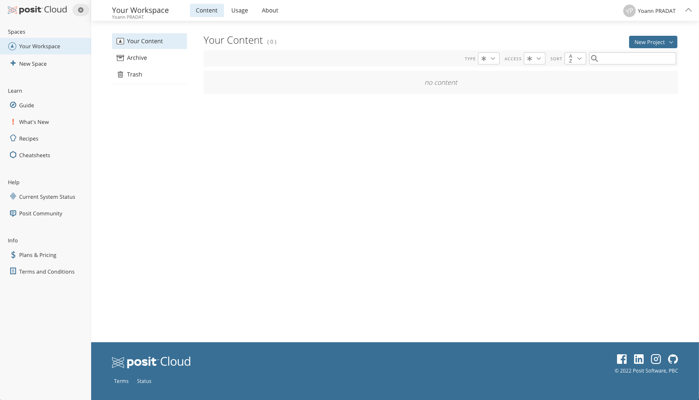

# Bienvenue dans le dossier "TPs" du module UE 11: Cancer et génomique: des données NGS aux modèles prédictifs

## Galaxy TPs

Pour suivre le TP "Galaxy", vous aurez besoin d'un navigateur web et d'un compte sur un serveur Galaxy public. 
- Creez-vous un compte sur <http://usegalaxy.eu>

Vous aurez également besoin de l'outil IGV qui permet de visualiser des données NGS alignées sur un génome. Cet outil
peut être installé localement sur votre ordinateur (tous systèmes) ou utilisé en ligne. La version installée localement
est plus réactive et agréable à utiliser.
- IGV: <http://software.broadinstitute.org/software/igv/download>


## R TPs

Pour suivre les TPs `R`, vous devez avoir accès à une session `R` avec certaines libraires pré-installées. Pour cela, nous
allons construire un environnement dédié au projet via la gestionnaire d'environnements
[conda](https://docs.conda.io/en/latest/). En bref, `conda` vous permet d'isoler vos projets `R` et rend votre code
facilement reproductible. Ce n'est pas la seule solution, `renv` est aussi pratique mais est limité au langage R alors
que `conda` est bien plus général.

Pour les TP 1 et 2, vous pouvez soit faire le TP en utilisant une session [posit cloud](https://posit.cloud) dont le
lien vous sera communiqué le jour J (Option 1 et recommandée), soit suivre depuis votre ordinateur (Option 2).

Il est recommandé de faire le TP depuis la session cloud qui vous est proposée dont l'environnement a été préalablement
testé. Si toutefois vous souhaitez suivre sans utiliser le cloud, assurez-vous d'avoir exécuté au préalable toutes les
instructions d'installations détaillées ci-dessous. Vous pouvez tester votre installation en exécutant en entier une
première fois les TP 1 et 2 tels qu'ils vous sont fournis.

## Option 1: Installation sur le cloud (recommandée)

1. La première fois que vous cliquez sur le lien cloud qui vous est fourni, il vous sera demandé de vous authentifier. Si
vous n'avez pas de compte vous pouvez vous connecter via votre adresse gmail ou votre compte github (recommandé) ou vous
pouvez créer un compte en cliquant sur "Don't have an account? Sign Up".

2. Une fois connecté, le projet se déploie sur votre compte et vous ouvre une session RStudio placée dans une copie de ce
répertoire github. Sur la barre des menus en haut, cliquez sur "Save a Permanent Copy" pour avoir votre copie du projet.
Ainsi, toute modification que vous ferez par la suite n'affectera que votre session et sera sauvegardée.

### 1.1 Découverte de R, Rstudio et du cloud.

Une fois connecté, vous arrivez sur une page ressemblant à la capture d'écran ci-dessous 



Cliquez ensuite sur "New Project" puis "New project from Git repository" et collez l'URL
"https://github.com/gustaveroussy/IFSBM-bigdata". Depuis l'onglet Terminal, exécutez

```
Rscript TPs/R_beginner/packages_install.R
```

Ensuite, depuis l'aborescence à droite, naviguez vers TPs > R_beginner et double-cliquez sur le fichier
`Rbeginner-exercices-1-3.Rmd`.  Cliquez ensuite sur le bouton "Knit" pour knit le document en entier une première fois.
La première fois, RStudio vous demande d'installer une dépendence supplémentaire: cliquez sur "Ok". Après quelques
instants d'exécution, le document rendu apparait au format html dans une nouvelle fenêtre. Si vous avez un popup
blocker, une fenêtre intitulée "Popup blocked" apparait d'abord. Cliquez alors sur "Try Again" et la Rmarkdown rendu
apparait.

Vous pouvez ensuite remplir les "chunks" de code pour une à une et tester votre code en cliquant sur le bouton vert
à droite de la "chunk" ou en utilisant un raccourci clavier. 

| Tâche | Raccourci Windows  | Raccourci macOS |
|---|---|---|
|Run current chunk |	Ctrl+Shift+Enter |	Command+Shift+Enter |
|Run all chunks above   | Ctrl+Alt+P   | Command+Option+P |
|Run current chunk |	Ctrl+Alt+C |	Command+Option+C |

### 1.2 Installation de conda et des dépendences

Depuis RStudio, cliquez sur l'onglet `Terminal` puis executez les commandes

```
Rscript TPs/R_cloud/packages_install.R
bash TPs/R_cloud/conda_setup.sh
bash TPs/R_cloud/tensorflow_setup.sh
```

*Remarque*: le script `conda_setup.sh` install miniconda3 tandis que `tensorflow_setup.sh` créé un un environnement
conda dans le lequel python et tensorflow sont installés. Cet environnement sera ensuite chargé au cours des TPs.

### 1.3 Lancement RStudio

Vous êtes normalement déjà placé dans une session RStudio après avoir relancé votre projet. Pour parez à des erreurs de
dépendances systèmes, re-installez manuallement la libraire  `stringi` en exécutant la commande suivante depuis la
`Console`.

### 1.4 Tests installations

Dans l'arborescence en bas à droite, naviguez jusqu'à `TPs > R_TP1 > src` pour le TP 1 ou
`TPs > R_TP2 > src` pour le TP 2, et double-cliquez sur le fichier `.Rmd` pour l'ouvrir. Cliquez ensuite
sur le bouton "Knit" pour knit le document en entier une première fois. La première fois, RStudio vous demande
d'installer une dépendence supplémentaire: cliquez sur "Ok". Après quelques instants d'exécution, le document rendu
apparait au format html dans une nouvelle fenêtre. Si vous avez un popup blocker, une fenêtre intitulée "Popup blocked"
apparait d'abord. Cliquez alors sur "Try Again" et la Rmarkdown rendu apparait.

Vous avez réussi, bravo!

## Option 2: Installation en local (bonnes connaissances requises)

ATTENTION: l'installation en local nécessite de bonnes connaissances en utilisation d'un terminal de commande et de
commandes de base telles que `git`, `cd`, `conda`. Si vous êtes déjà perdu, choisissez l'option "cloud".

Si ce n'est pas déjà fait, faites une copie de ce répertoire sur votre ordinateur via la commande

```
git clone https://github.com/gustaveroussy/IFSBM-bigdata
```

et placez-vous à l'intérieur du dossier `IFSBM-bigdata` depuis votre terminal de commandes.


### 2.1 Installation de conda

Assurez d'avoir la commande `conda` installée sur votre ordinateur. La commande est disponible en téléchargeant
[Anaconda](https://www.anaconda.com/products/individual) ou [Miniconda](https://docs.conda.io/en/latest/miniconda.html),
qui est une version plus minimaliste (prends moins d'espace) de `conda`.

Ouvrez un terminal et vérifier que la commande `conda` est bien disponible en faisant `which conda` (Mac, Linux) ou
`where.exe conda` (Windows powershell).

### 2.2 Installation des environnements R TP 1 et R TP 2

Pour installer les environnements nécessaires aux 2 TP, exécutez les commandes

```
conda env create -f TPs/R_TP1/r_tp1.yaml
conda env create -f TPs/R_TP2/r_tp2.yaml
```

Ces commandes créent 2 environnements conda, `r_tp1`  et `r_tp2`, qui serviront à l'exécution des TPs.

### 2.3 Lancement de RStudio (ou autre IDE)

Si vous n'avez pas d'IDE déjà installé, téléchargez et installez RStudio depuis [cette
page](https://www.rstudio.com/products/rstudio/download/#download). Lorsque vous ouvrez RStudio, l'interpréteur
`R` utilisé sera celui installé par défaut sur votre ordinateur. Pour avoir toutes les librairies nécessaires pour le TP
1, vous devez configurer RStudio pour que l'interpréteur `R` utilisé soit celui de l'environnement `r_tp1` créé
ci-dessus (de même vous devrez configurer RStudio pour utiliser l'interpréteur `R` de l'environnement `r_tp2`
pour le TP 2).

Pour configurer l'interpréteur `R` de RStudio, 3 solutions possibles:

1.  Depuis le terminal de commande, activez l'environnement conda `r_tp1` (resp. `r_tp2`) et lancez RStudio
    ou votre IDE préféré avec la commande (exemple avec Mac)

    ```
    open -a RStudio
    ```

2. Depuis RStudio, allez dans Outils (Tools) > Options Générales (Global Options). Dans le menu Général (General),
   remplacez le chemin par défaut par le chemin de la commande `R` de votre environnemnt `r_tp1`. Par exemple,
   `/usr/local/anaconda3/envs/r_tp1/bin/R`.  Cette solution n'a pas été testée.

3. Vous pouvez configurer les paramètres de de RStudio en exportant des variables d'environnement dans un
   fichier `~/.profile`. Plus précisément, exécutez les commandes suivantes depuis votre terminal de commande

    ```
    echo "export RSTUDIO_WHICH_R=/path/to/r_tp1/bin/R" > ~/.profile
    echo "export R_LIBS_USER=/path/to/r_tp1/lib/R/library" >> ~/.profile
    echo "export R_LIBS_SITE=/path/to/r_tp1/lib/R/library" >> ~/.profile
    ```

    où vous devez remplacer `/path/to` par le chemin correspondant sur votre ordinateur. Redémarrez ensuite votre
    Rstudio. Cette solution a été partiellement testée. Des problèmes ont été rencontrés avec des versions récentes de
    `Rstudio` (cf cet [issue sur github](https://github.com/rstudio/rstudio/issues/12508)). Une installation d'une
    version de Rstudio datant d'avant 12/2022 peut-être nécessaire.


### 2.4 Tests installations

Placez vous dans le dossier `TPs` en faisant `File > New Project >  Existing Directory > IFSBM-bigdata > TPs`.
Ouvrez le fichier Rmarkdown de la séance à savoir `R_TP1/src/TP1.Rmd` ou `R_TP2/src/TP2.Rmd` et faites
une première fois un knit du fichier (bouton `knit`) sur RStudio.

## Utilisation des notebooks R

Les *R notebooks* sont des documents R Markdown (*.Rmd*) avec des parties textuelles et des parties de code R
(appelées *chunks*) qui peuvent être exécutées de manière indépendente et interactive. Une introduction à leur
utilisation est incluse dans le premier TP (cf `R_TP1/src/TP1.Rmd`).
