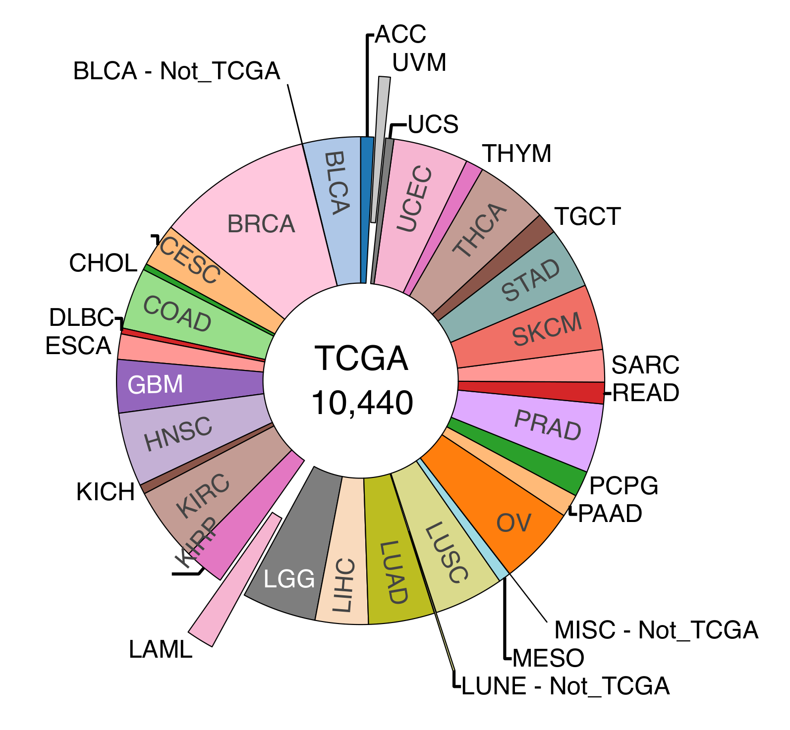

<style>
body {
text-align: justify}
</style>


```{r ifsbm logo, echo = FALSE, out.width = '50%', fig.align="center"}

eval_chunks <- FALSE
```

# 1. What you will do in this R Notebook

## 1.1 Introduction
With this notebook you will work on **real cancer genomic data** to address clinical questions.  The problem can be
summarized this way: your input is a huge amount of variables, such as DNA or RNA sequences for each patient, that you
wish to use in order to provide clinicians with interpretable information that they can use for their patients.

The main challenge is how to **reduce information so that it becomes understandable for a human**. That is a central
objective in many machine learning projects.

Extracting biomedical knowledge from high-dimensional molecular data is currently part of the main challenges of
personalized medicine, so let's hope you'll enjoy this introductive notebook and that it can help you to address your
current and/or future research challenges.

## 1.2 Main steps

In this notebook, you will be guided through **TCGA** data. Briefly, TCGA is an american--led international consortium
initiated in 2006 and completed in 2018 with the publication of 23 research papers forming the PanCancer Atlas
[@the_cancer_genome_atlas_research_network_cancer_2013]. It aimed
at deciphering the molecular profiles of 33 common cancer types. If you want to know more, check the [TCGA official
page](https://www.cancer.gov/ccg/research/genome-sequencing/tcga) and the [PanCancer Atlas
webpage](https://www.cell.com/pb-assets/consortium/pancanceratlas/pancani3/index.html).

We shall download only parts of the data in order to be able to run jobs within a reasonable amount of time. To achieve
this we will try to make the most of prior biomedical research and reduce our queries to most relevant genes.

The notebook is organized as follows

1. in a first step we will implement a simple classification model perform a binary classification task from
   expression data.
2. in a second step we will implement simple and regularized classification models to perform a 4-class
   classification task from expression data.
3. in a third step, we will implement a deep neural network to perform a many-class classification task from expression
   data.

The examples we will see have a real scientific and medical interest. To dive further, you are more than welcome to
apply for internships or permanent positions of research teams to become a researcher in bioinformatics and/or machine
learning.

## 1.3 In practice

The code is provided to you. You will just have to follow the instructions all along the notebook.
Explanations and corrections will be given throughout the notebook for a subset of the questions.

**IMPORTANT**
There are questions in this notebook that you need to answer and code that you need to write by yourself during the lab
or at home. The ones you have to do during the lab are be indicated by a tag "INCLASS WORK", and the ones you have to
after the class are indicated by "HOME WORK".

You will have to **complete both** and send the completed notebooks back to us. These completed notebooks will be
**USED FOR EVALUATING YOUR WORK IN THIS MODULE AND GIVE YOU A MARK**.

# 2. Get familiar with R notebooks

## 2.1 What is an R notebook

An  *R notebook* is an R Markdown document (*.Rmd*) with text parts and R code parts (called *chunks*) that can be
executed independently and interactively. R notebooks can be rendered (or knit) into different formats (*.pdf*, *.html*,
*.docx*) using a renderer.  The `rmarkdown` R package ([see doc
here](https://cran.r-project.org/web/packages/rmarkdown/rmarkdown.pdf)) provides a lot of functions to render a
notebook.

Running `render('TP1.Rmd', html_document())` from the R console will create a
file *TP1.html*  that you can then open with your favorite web browser.

`RStudio` already provides you with commands to render your R notebook by taking into accounts the headers that are
specified at the top of document. You can knit your notebook with the `Preview` button or by pressing `Ctrl+Shift+K` (OS
X: `Cmd+Shift+K`).

*Pratical info*: A list of all the keyboard shortcuts for `Rstudio` is available
[here](https://support.rstudio.com/hc/en-us/articles/200711853-Keyboard-Shortcuts).

Here is an example of YAML headers for specifying the output format.

```yaml
title: Nineteen Years Later
author: Harry Potter
date: July 31, 2016
output:
  rmarkdown::html_document:
    theme: lumen
```

## 2.2 Execute your first **chunks**

Try executing the following chunk by clicking the `Run` button within the chunk or by placing your cursor inside it and
pressing `Ctrl+Enter` from within `R Studio`.

```{r welcome}
print("Welcome to 'Big Data et predictive models' lab session")
```

In order to create a new chunk, open it with "\`\`\`{r}" and close it with "\`\`\`". Alternatively, press `Ctrl + Alt +
I` (OS X:` Cmd + Option + I`) or the Add Chunk button in the tool bar of `R Studio`. Chunks rendering can by customized
by specifying chunk options among the following

- `include = FALSE` prevents code and results from appearing in the finished file. R Markdown still runs the code in the
  chunk, and the results can be used by other chunks.
- `echo = FALSE` prevents code, but not the results from appearing in the finished file. This is a useful way to embed
  figures.
- `message = FALSE` prevents messages that are generated by code from appearing in the finished file.
- `warning = FALSE` prevents warnings that are generated by code from appearing in the finished.
- `fig.cap = "..."` adds a caption to graphical results.
- `fig.width = 4` width of the graphical results
- `fig.height = 3` height of the graphical results
- `fig.align = "center"` height of the graphical results
- `dev = "png"` the graphical device to generate plots
- ...

Options can also be set from within the chunk using the syntax `knitr::opts_chunk$set()`. For instance,
`knitr::opts_chunk$set(fig.width = 6, fig.height = 6)` will set the figure height and width. For more details about
chunk options, see the online documentation [https://yihui.org/knitr/options/](https://yihui.org/knitr/options/).

**INCLASS WORK**: Complete the `R` chunk below to display a plot of the cosinus and sinus functions on $[-\pi, \pi]$
without showing the code, with a caption, with a width and height of 8 and 4 respectively. The plot should additionally
be centered. You will need to set chunk options as explained above and you will need the `seq`, `cos` and `sin`
functions. To know more about a function, you may type `?[function_name]` in the R console.

*NOTE*: All the chunks have been set to `eval=eval_chunks` with `eval_chunks=FALSE` so that you can render your TP without
errors as you make progress. Don't forget to set the chunk option` eval=TRUE` when working on a chunk.


```{r first code, eval=eval_chunks}
# YOUR WORK HERE
```

# 3. "Standard" classification.

Over the course of the last three decades, many studies were conducted in which molecular and clinical data from
about individuals with particular medical conditions (a specific cancer type for instance) were collected in order to
describe the **molecular profile** of these conditions and better understand how they influence clinical outcomes.

The Cancer Genome Atlas Project (**TCGA**), an american-led international consortium, has collected data from  more than
11,000 cancer patients. Many **tumor types** are represented in this cohort as depicted in the pie plot below.

```{r tcga tumor types, echo = FALSE, out.width = '75%', fig.align="center"}

```

The data that was collected includes **DNA sequencing data** (SNV, SV, CNA), **RNA sequencing data** (microarrays and
RNA-seq, providing gene expression tables), **methylation data**, **miRNA sequencing data**, **proteomics data** and
**clinical data**. This *huge* data collection has made possible countless research projects, many of which revealed
clinical relevant results that redefined our understanding of the cancer genesis and evolution, and continues today to
fuel active research.

The anonymized data is either in restricted or public access. To access the raw data (sequencing reads) you will need
the authorization of a data user committee. To access processed data (e.g gene expression tables), you don't need any
authorization. It can nevertheless be difficult to retrieve this data by hand and then load it into R.

In this part of the notebook we will conduct a classification experiment using **expression data** from the TCGA. As you
may know, the human genome contains tens of thousands of genes giving rise to gene expression tables whose storage may
required close to 10Gb for the largest cohorts. For practical reasons, we shall only retrieve expression
data for specific lists of genes.

## 3.1 About the Cancer Gene Census

Using the mutation data collected from large projects, researchers observed that mutations occur in non-random positions
along the genome and that some loci are more frequently mutated than others in patients presenting a particular
condition. Modeling and rigorous statistical tests have highlighted signals of positive selection and signals of
non-random distributions of mutations in certain genes that we now designate as "**cancer genes**" or "**driver genes**"
whose alterations are thought to be cancer-causing. Many statistical methods were developed to identify these genes and
methods do not agree completely on which genes are relevant for cancer or not (see reviewing work in
[@tokheim_evaluating_2016]). One of these lists, called the Cancer Gene Census, is a manually list that only incldues
genes that have an established role in cancer. This list is used worldwide in many biomedical studies but continue to
evolve over time.

Since it began in 2004 [@futreal_census_2004], the **Cancer Gene Census** has established a list of over 700 genes  with
a comprehensive description of all the evidence for their involvement in cancer. The CGC teams lead a very thorough
curation process for including only genes for which the evidence is unequivocal. The latest paper from the group in
2018 [@tamborero_cancer_2018] presents the curation process in details and the categorization of genes into **two tier
lists**.

- Tier 1: genes that "possess a documented and reproducible activity relevant to cancer, along with evidence of
  mutations in cancer that change the activity of the gene product in a way that promotes oncogenic transformation"
- Tier 2: "genes with more recently identified roles in oncology, and consists of genes with strong indications of a
  role in cancer but with less strong mechanistic or functional evidence"

The Cancer Gene Census has already been downloaded for you and is available in the `R_TP1/data` folder under the name
`CancerGeneCensusCOSMIC_20240117.csv`.

## 3.2 Load expression data from the TCGA

For the purpose of this notebook, we have defined a function that will load the data you need from a list of genes and
cancer types. The processed data comes from [cBioportal](http://www.cbioportal.org/), a reference website widely used
for the exploration and downloading of data used in research papers.

For that you will simply need to load `.RDS` objects where the data has already been downloaded for you.
For the next steps we will be using `R` libraries. Load them with the following

```{r load libraries expression, message=FALSE, warning=FALSE}
suppressPackageStartupMessages(library(RColorBrewer))
suppressPackageStartupMessages(library(glmnet))
suppressPackageStartupMessages(library(dplyr))
suppressPackageStartupMessages(library(tidyr))
suppressPackageStartupMessages(library(yarrr))
suppressPackageStartupMessages(library(knitr))
```

The next chunk defines two functions that will be useful for visualizing the results of your classification models. An R
function may take as input one or multiple arguments that you may change depending on the task you want to perform.
Execute the chunk in order to load these functions into your R environment.

```{r useful functions expression}
getColors <- function(vec, pal="Dark2", alpha=0.7){
  colors <- list()

  palette_predefined <- read.csv("../data/colors.csv")
  palette_predefined <- setNames(palette_predefined$Color, palette_predefined$Name)
  palette_default <- brewer.pal(max(length(unique(vec)),3), pal)
  i <- 1
  for (v in unique(vec)){
    if (toupper(v) %in% names(palette_predefined)){
      colors[[v]] <- adjustcolor(palette_predefined[[toupper(v)]], alpha)
    } else {
      colors[[v]] <- adjustcolor(palette_default[[i]], alpha)
      i <- i+1
    }
  }
  colors
}


getConfusionMatrix <- function(labelsPredicted, labelsCorrect, labels=NULL){
  if (is.null(labels)){
    labels <- unique(union(labelsPredicted, labelsCorrect))
  } else {
    labels <- unique(labels)
  }
  confMat <- data.frame(row.names=labels)

  for (labelPredicted in labels){
    for (labelCorrect in labels){
      confMat[labelPredicted, labelCorrect] <- sum(labelsPredicted==labelPredicted & labelsCorrect==labelCorrect)
    }
  }

  confMat
}


plot_coefs_logistic_regression <- function(nCoeffsPlot=20, CoeffsA, CoeffsB, colorA, colorB){
  ymax <- max(abs(CoeffsA)[1], abs(CoeffsB)[1])
  ymax <- ceiling(ymax/10**(round(log10(ymax))))*10**(round(log10(ymax)))
  xx <- barplot(height=c(CoeffsA[1:nCoeffsPlot], CoeffsB[1:nCoeffsPlot]),
                col=c(rep(colorA, nCoeffsPlot), rep(colorB, nCoeffsPlot)),
                cex.names=0.7, las=2, ylim=c(-ymax, ymax))

  text(xx[1:nCoeffsPlot]+1,
       y=-1,
       label=rownames(CoeffsA)[1:nCoeffsPlot],
       pos=2,
       cex=0.7,
       srt=90)

  text(xx[(nCoeffsPlot+1):(2*nCoeffsPlot)]-0.75,
       y=1,
       label=rownames(CoeffsB)[1:nCoeffsPlot],
       pos=4,
       cex=0.7,
       srt=90)
}


plot_coefs_multinomial_regression <- function(coef_matrix, mar=c(0,3,2,0), oma=c(2,2,2,2)){
  # Prepare for plotting
  classes <- colnames(coef_matrix)
  covariates <- rownames(coef_matrix)
  n_classes <- ncol(coef_matrix)

  # Barplot
  par(mfrow = c(1, n_classes), mar=c(0,3,2,0), oma=c(2, 2, 2, 2))
  for (i in 1:n_classes) {
    bar_values <- coef_matrix[, i]

    # Separate positive and negative values
    pos_values <- pmax(bar_values, 0)  # Positive values
    neg_values <- pmin(bar_values, 0)  # Negative values

    # Create horizontal bars
    barplot(
      pos_values, horiz = TRUE, xlim = c(min(bar_values), max(bar_values)),
      names.arg = covariates, las = 2, col = "blue",
      main = classes[i], cex.names=0.4, cex.main = 1.2,
      space=0.2, width=0.8, border=NA, axes=T
    )
    barplot(
      neg_values, horiz = TRUE, xlim = c(min(bar_values), max(bar_values)),
      names.arg = FALSE, col = "red", add = TRUE,
      space=0.2, width=0.8, border=NA
    )

    abline(v = 0, col = "black", lwd = 0.5, lty = 1)
  }
}
```

&nbsp;

**INCLASS WORK** Load the list of genes from the cancer gene census file `../data/CancerGeneCensusCOSMIC_20240117.csv`
and then load the *normalized* RNA expression profiles for the `BLCA` and `LUSC` TCGA **pancancer atlas 2018 studies**
by loading the `blca_lusc_exp.RDS` object.

More specifically

1. Use the `read.csv` function (this function is a base R function so you don't need to load any library to use it) to
   load the Cancer Gene Census file `../data/CancerGeneCensusCOSMIC_20240117.csv` and extract the list of gene symbols
   into a variable `CgcGenes`.
2. Use the `readRDS` function to load the data `../data/blca_lusc_exp.RDS` into a `TcgaData` variable.
3. Explore the contents of the list.

&nbsp;

*Hint*: In regular expression (i.e computer language), the "OR" logical connector is written `|`. Moreover, in R `T`
stands for `TRUE` and `F` stands for `FALSE`. Look at the arguments of `LoadcBioportal` to understand the possibilities
of the function.

&nbsp;

```{r load tcga expression data, eval=eval_chunks}
CgcGenes <- # YOUR WORK HERE
TcgaData <- # YOUR WORK HERE
print(names(TcgaData))
print(TcgaData$STUDY)
```

Observe that mutation data were not added to this list because of the argument because `TcgaData$MUT` has dimensions
[0,0]. The `TcgaData$STUDY` table tells you how many patients have been loaded in each table of each study. It may
happen that data modalities (clinical, expression, mutation) are not available across all patients.

**INCLASS WORK** Intersect the lists of patients of `EXP` and `CLINIC` tables (patient names are stored in the row
names) to select only patients having both clinical data and expression profiles. Save the output into a `patients_common`
variable. Then the tables are subsetted and aligned to the this patient list. You will need the `intersect` and
`rownames` R functions for this task.

```{r intersect patients, eval=eval_chunks}
patients_common <-  # YOUR WORK HERE

TcgaData$CLINIC <- TcgaData$CLINIC[patients_common,]
TcgaData$EXP <- TcgaData$EXP[patients_common,]
```

We now have `TcgaData$EXP` and `TcgaData$CLINIC` data tables with the same patients as rows and no NAs.

## 3.3 Description of the data

The first very important step is to visualize and describe your data. It can be tricky when you have huge
multidimensional matrices.

For continuous data such as RNA-seq, simply plotting the distribution is a good first step. The expression profiles were
normalized using a log-min-max normalization ($X$ is original profile of size the number of genes, $Y=log10(X+1)$,
$Z=\frac{Y-min(Y)}{max(Y)-min(Y)}$) of expression values from cbioportal. The following chunk display the distribution
of normalized gene expression across patients and genes for BLCA and LUSC.

```{r visualize expression data per gene, fig.cap="Genes expressions", fig.height=8, fig.width=8, fig.align="center", eval=eval_chunks}
set.seed(1995)
colorsStudy <- getColors(TcgaData$CLINIC$study, alpha=1)
genesExp <- colnames(TcgaData$EXP)
genesHist <- sort(sample(genesExp, size=9, replace=F))
par(mfrow=c(3,3), mai=c(0.35,0.4,0.35,0.4))

for (geneHist in genesHist){
  mask_blca <- TcgaData$CLINIC$study=="blca"
  mask_lusc <- TcgaData$CLINIC$study=="lusc"
  DataGene <- rbind(data.frame(Expression=TcgaData$EXP[mask_blca,geneHist], Tumor="blca"),
                    data.frame(Expression=TcgaData$EXP[mask_lusc,geneHist], Tumor="lusc"))

  pirateplot(formula=Expression ~ Tumor,
             data=DataGene,
             theme=1,
             quant=NULL,
             pal=colorsStudy,
             main=geneHist,
             xlab="")
}
```

A very popular visualisation tool for data matrices are heatmaps. However you may draw a heatmap only if you do not have
too many samples and too many variables. The `heatmap` base function additionally allows you to perform hierarchical
clustering of the rows and or the columns to highlight clusters of variables and or samples.

```{r visualize expression data heatmap, fig.cap="Genes expression heatmap", fig.height=8, fig.width=8, fig.align="center", eval=eval_chunks}
rowNames <- rownames(TcgaData$EXP)
rowStudy <- TcgaData$CLINIC[rowNames, "study"]
rowSideColors <- sapply(rowStudy, function(x) colorsStudy[[x]])
heatmap(as.matrix(TcgaData$EXP), Rowv=NULL, Colv=NULL, keep.dendro=F, RowSideColors=rowSideColors)
```

**INCLASS_WORK** Answer to the numbered questions throughout the notebook.

&nbsp;

**QUESTION 1)** What are TPM and RPKM? The log-min-max  normalization was applied on the **mRNAseq v2 values** molecular
profiles of cbioportal which correspond to rsem.genes.normalized_results files from TCGA as explained in the
documentation [here]<https://docs.cbioportal.org/user-guide/faq/#how-is-tcga-rnaseqv2-processed-what-units-are-used>.
Are the expression profiles in `TcgaData$EXP` table modified (log-min-max normalization) TPM values?
RPKM values?

*Hint*: To understand what rsem.genes.normalized_results TCGA files are, read the answer to the following post
<https://www.biostars.org/p/106127/>.

&nbsp;

**ANSWER**:

&nbsp;

**QUESTION 2)** How would you qualify the distribution(s) of the log-min-max normalized RNA data of each gene? Give gene
names that illustrate the type(s) of distribution you see.

*Hint*: You may play with the value of the random number generator seed in the chunk with plots per gene or remove it
altogether and run the chunk multiple times to explore different genes.

&nbsp;

**ANSWER**:

&nbsp;

Another popular way of visualising high-dimensional data is first by reducing its dimension and then visualise it into
the lower-dimensional representation. The **Principal Component Analysis** with $k$ components allows you to find the
$k$ dimensional subspace that retains the most of the variance of the data in the original space. PCA of $\mathbf{X}$
may be performed by performing **Singular Value Decomposition** on the centered matrix.

```{r compute PCA, eval=eval_chunks}
X <- t(t(TcgaData$EXP) - rowMeans(t(TcgaData$EXP)))
resSVD <- svd(X, nu=2, nv=2)
# the scores are the principal components i.e the
# low-dimensional representations of the samples
scores <- resSVD$u %*% diag(resSVD$d[1:2])
```

```{r draw PCA, fig.cap="PCA TCGA expression data", fig.height=6, fig.width=6, fig.align="center", eval=eval_chunks}
# plot the two first principal components
plot(scores[,1],scores[,2],
     col=unlist(colorsStudy[TcgaData$CLINIC$study]),
     pch=16,main='PCA representation',
     xlab=paste("dim1 = ",100*round(resSVD$d[1]^2/sum(resSVD$d^2),3),"%",sep = ""),
     ylab=paste("dim2 = ",100*round(resSVD$d[2]^2/sum(resSVD$d^2),3),"%",sep = ""))
legend("bottomright",legend=c("blad","lusc"), pch=16, cex=0.8, col=c(colorsStudy[["blca"]], colorsStudy[["lusc"]]))
```

## 3.4 Your first classification model

### Train/test split

We would like to have a model to identify the study of origin of the RNA samples from their gene expression. We shall
continue to rely on the gene expression of only the Cancer Gene Census. In here we are going to fit a `logistic
regression` model that we saw this morning to perform this classification task.

To begin with, we shall split the data into a training set and a test set.

```{r split train/test, eval=eval_chunks}
# split total list of rows betweeen data between train and test row lists
totalIndex <- row.names(TcgaData$CLINIC)
totalSize <- length(totalIndex)
trainProp <- 0.8
trainIndex <- sample(totalIndex, size=round(totalSize*trainProp))
testIndex <- totalIndex[!totalIndex %in% trainIndex]

# record correct labels for train/test
studyCorrectTrain <- as.matrix(TcgaData$CLINIC)[trainIndex,"study"]
studyCorrectTest <- as.matrix(TcgaData$CLINIC)[testIndex,"study"]

cat(paste("Training size:", length(trainIndex), "\nTest size:", length(testIndex)))
```

**QUESTION 3)** Why is it important to split the data into a training set and a test set?

**ANSWER**:

&nbsp;

### Fit the model.

The [glmnet](https://cran.r-project.org/web/packages/glmnet/glmnet.pdf) R package is a great tool for fitting all
kinds of linear models. GLM stands for for **Generalized Linear Models** which a global family of models that encompass
many linear models including the linear regression (for continuous predictions), logistic regression (for class
predictions), Poisson regression (for count data), Gamma regression (log normal data), etc. **Logistic
regression** is GLM from the **binomial family** of distributions with a **logit link**.


**INCLASS WORK** Use the [glmnet](https://cran.r-project.org/web/packages/glmnet/glmnet.pdf) R package to fit a logistic
regression model **without regularisation** on the expression data from patients in the training set to predict the
study membership of RNA samples.

*Hint*: Type `?glmnet` in the console to read the documentation of the function. You will need to use the `trainIndex`
variable to select rows (=patients) in the training set. To deactivate regularization, you will need to set the `alpha`
and `lambda` parameters to 0.

```{r fit glmnet no reg, eval=eval_chunks}
fit <- glmnet(
# YOUR WORK HERE
)
```

### Assess the model

**QUESTION 4)** How do you evaluate a classification model? Give at least two metrics you think of to describe the quality
of the model.

**ANSWER**

&nbsp;

**INCLASS WORK** Use the `predict` function to get the predictions your model on *both* the train and test data. Use the
predictions to compare against the true values of the tumor type available in `TcgaData$CLINIC$study` vector. Use
the `getConfusionMatrix` to quantify the quality of the model by computing the [confusion
matrix](https://en.wikipedia.org/wiki/Confusion_matrix). You may also quantify the quality of your model using metrics
you mentioned in your previous answer.

*Hint*: You will need to use the `as.matrix` function to provide matrices to the `newx` argument of `predict` function.
To retrieve class labels instead of probabilities, you will need to specify the option `type="class"`.You may check beforehand if your variable is
a matrix by running `is.matrix(your_variable)`. To retain the row names when extracting the vector of correct labels,
use the syntax `as.matrix(your_dataframe)[your_index_selection,"your_column_name"]`. You will need to use the variables
`studyCorrecTrain` and `studyCorrectTest` to compute the train and test accuracies and confusion matrices.

```{r confusion matrix no reg, eval=eval_chunks}
# get predictions on train/test
studyPredictedTrain <-  # YOUR WORK HERE
studyPredictedTest <-  # YOUR WORK HERE

# get accuracies
# you need here the variables studyCorrectTrain and studyCorrectTest
accuracyTrain <- # YOUR WORK HERE
accuracyTest <- # YOUR WORK HERE
cat(paste("Training accuracy:", accuracyTrain, "\nTest accuracy:", accuracyTest))

# get confusion matrices
# you need here as well the variables studyCorrectTrain and studyCorrectTest
confMatTrain <- # YOUR WORK HERE
confMatTest <- # YOUR WORK HERE

# display confusion matrices
kTrain <- kable(confMatTrain, caption="Train")
kTest <- kable(confMatTest, caption="Test")
kables(list(kTrain, kTest), format="html", caption="Confusion matrices BLCA/LUSC")
```

## 3.5 Another classification task

As evidenced by the performance of a simple classification model, the task of distinguishing the tumor types `BLCA` and
`LUSC` using the levels of expression of known cancer genes is an easy task. Let us now move to a harder classification
task that will aim at predicting the tumor stage using again the levels of expression of selected genes. The tumor stage
is encoded by the TNM system devised by the American Joint Committee on Cancer (AJCC). Once the T, N, and M values of
the tumor are determined, they are combined and an overall stage of 0, I, II, III, IV is assigned. Sometimes these
stages are subdivided as well, using letters such as IIIA and IIIB. Read the page
<https://www.facs.org/quality-programs/cancer-programs/american-joint-committee-on-cancer/cancer-staging-systems/> to
know more about this staging system.

As the biology of cancer cells is known to differ significantly from one tumor type to another, we will focus on one
tumor type, namely `BLCA`. The task is therefore to predict the tumor stage in bladder tumors using expression data from
selected genes.

### Data preparation

**INCLASS WORK** In `TcgaData$CLINIC` table, the stage is encoded in the `AJCC_PATHOLOGIC_TUMOR_STAGE` variable. To
limit the complexity of the classification task, your first job is to simplify the
`AJCC_PATHOLOGIC_TUMOR_STAGE` to remove substage info and record it into the variable `SIMPLE_TUMOR_STAGE`. Your second
job is to further simplify the stage into a binary variable `BINARY_TUMOR_STAGE`
containing "Early stage" for stages I and II and "Late stage" for stages "III" and "IV".

*Hint*: You can use the `gsub` function to remove parts of a string using regex patterns. For instance the command
`gsub("[X]$", "", mystring)` removes the `X` character from `mystring` variable if and only if it ends with `X`. In other
words, if `mystring` is `lateX` then the command will return `late` but if `mystring` is `lateXes` it will not modify
the variable. Regexes are case-sensitive  meaning that if `mystring` is `latex` then the command will not remove the
small cap `x` at the end. You can add `x` in your matching pattern in different ways, one of which is to use the regex
`"[xX]$"` instead of `"[X]$"`. You will need the regex `"[ABC]$"` to remove `A`, `B`, or `C` suffixes in strings. For
your information, `gsub` function can be applied on vectors. Type `?gsub` for more information about the function.

For the binarization task, you will need to combine the `names` and `match` functions. For a named vector
`color_to_letter <- c("A"="red", "B"="blue", "C"="violet")` and a vector of data `mycolors <- c("red", "blue", "red",
"red", "violet")`, running `match(mycolors, color_to_letter)` will return  `c(1,2,1,1,3)` which are the indices of the
values in `color_to_letter` matching the values of the vector `mycolors`. You may then apply this vector of indices on
`names(color_to_letter)` to translate colors into letters in a manner similar to dictionaries in Python.

See also this post <https://stackoverflow.com/questions/49798684/replacing-values-in-a-column-using-a-named-list> for
another example code of how to remap values in a column of a dataframe using a named vector.


```{r simplify tumor stage, eval=eval_chunks}
# check thee distribution of tumor stages
table(TcgaData$CLINIC$AJCC_PATHOLOGIC_TUMOR_STAGE)

# remove subtypes
TcgaData$CLINIC$SIMPLE_TUMOR_STAGE <- # YOUR WORK HERE

# check that no NAs were introduced or removed
NAs_before <- is.na(TcgaData$CLINIC$AJCC_PATHOLOGIC_TUMOR_STAGE)
NAs_after <- is.na(TcgaData$CLINIC$SIMPLE_TUMOR_STAGE)
stopifnot(all(NAs_before == NAs_after))

# binarize
TcgaData$CLINIC$BINARY_TUMOR_STAGE <- # YOUR WORK HERE

# check again that no NAs were introduced or removed
NAs_after <- is.na(TcgaData$CLINIC$BINARY_TUMOR_STAGE)
stopifnot(all(NAs_before == NAs_after))

# get a vector of colors
colorsStage <- getColors(TcgaData$CLINIC$BINARY_TUMOR_STAGE, alpha=1)
```

### Train/test split and tumor type selection

To begin with, we shall split the data into a training set and a test set.

**INCLASS WORK** Retrieve the row names (=indices) in `TcgaData$CLINIC` and `TcgaData$EXP` corresponding to patients from
`study=blca` patients. Remove the indices of patients with NAs in the variable `AJCC_PATHOLOGIC_TUMOR_STAGE`, and then
split the selected indices into a train and a test indices vectors as done in the previous classification task. Use
a train/test ratio of 80%/20%.

*Hint*: The `totalIndex` vector contains all indices (= row names) of TcgaData tables i.e `BLCA` and `LUSC` patients. To
get only the indices corresponding to `BLCA` patients, you may apply a mask of TRUE/FALSE values on `totalIndex`.  For
instance, if `totalIndex` is `c("Gaby", "John", "Tom", "Ethan")` then the command `totalIndex[c(TRUE, FALSE, TRUE,
TRUE)]` will return `c("Gaby", "Tom", "Ethan")`.

```{r split train/test tumor stage, eval=eval_chunks}
# select only BLCA patients
totalIndex <- row.names(TcgaData$CLINIC)
totalBlcaIndex <- # YOUR WORK HERE
totalBlcaSize <- length(totalBlcaIndex)

# remove patients with NAs for AJCC_PATHOLOGIC_TUMOR_STAGE
NAsStageIndex <- # YOUR WORK HERE
totalBlcaIndex <- totalBlcaIndex[!totalBlcaIndex %in% NAsStageIndex]

# split selected indices into train and test
trainProp <- # YOUR WORK HERE
trainBlcaIndex <- # YOUR WORK HERE
testBlcaIndex <- # YOUR WORK HERE

# record correct labels for train/test
stageCorrectBlcaTrain <- as.matrix(TcgaData$CLINIC)[trainBlcaIndex,"BINARY_TUMOR_STAGE"]
stageCorrectBlcaTest <- as.matrix(TcgaData$CLINIC)[testBlcaIndex,"BINARY_TUMOR_STAGE"]

cat(paste("Training size:", length(trainBlcaIndex), "\nTest size:", length(testBlcaIndex)))
```

### Fit and assess the model.

**INCLASS WORK** As done in the previous task, use the
[glmnet](https://cran.r-project.org/web/packages/glmnet/glmnet.pdf) R package to fit a binomial logistic regression
model on the expression data to predict the binary tumor stage of `BLCA` RNA samples and then assess the quality of your
model. Don't forget to train only on the training data. You will need to use the `trainBlcaIndex` variable.

```{r fit glmnet no reg BLCA, eval=eval_chunks}
# fit the model
fitBlca <- glmnet(
  x=# YOUR WORK HERE
  y=# YOUR WORK HERE
  family="binomial",
  alpha=0,
  lambda=0,
)

# get the model predictions on the train and test splits
BlcaPredictedTrain <- # YOUR WORK HERE
BlcaPredictedTest <- # YOUR WORK HERE

# get the model train/test accuracies
accuracyBlcaTrain <- # YOUR WORK HERE
accuracyBlcaTest <- # YOUR WORK HERE
cat(paste("Training accuracy:", accuracyBlcaTrain, "\nTest accuracy:", accuracyBlcaTest))

# get the confusion matrices
confMatBlcaTrain <- getConfusionMatrix(BlcaPredictedTrain, stageCorrectBlcaTrain)
confMatBlcaTest <- getConfusionMatrix(BlcaPredictedTest, stageCorrectBlcaTest)

# display the confusion matrices
kBlcaTrain <- kable(confMatBlcaTrain, caption="Train")
kBlcaTest <- kable(confMatBlcaTest, caption="Test")
kables(list(kBlcaTrain, kBlcaTest), format="html", caption="Confusion matrices BLCA tumor stage")
```


**QUESTION 5)** Comment on the difference of model performance between the train and test splits. How is this situation
described in machine learning terms? How do you explain this situation and can you think of a strategy to overcome it?

&nbsp;

**ANSWER**:

&nbsp;

### Understand the model coefficients

The medical doctor you are working with is not very satisfied with your model and would like to know what are the most
discriminative genes to see if we could think of a way to improve the model.

**INCLASS WORK** Extract the coefficients of the model using `coefficients(fitBcla)` and then store coefficients
contributing to predicting "Early stage" and the coefficients contributing to predicting "Late stage" into two distinct
character vectors. The sign of the coefficients helps you distinguish the two. We will then visualize the values of the
coefficients assigned to these genes by the model.

*Hint:* Observe that when fitting the model, the labels are internally "cast" into a `factor` variable by the `glmnet`
function. This `factor` column is then converted into numeric values internally to fit the model. In a binary
classification task, negative coefficients contribute to predicting the "0" class while positive coefficients contribute
to predicting the "1" class. You can check the order levels of a `factor` variable by running
`levels(as.factor(your_variable))` to know what label was mapped to 0 and what label was mapped to 1.

```{r interpret coefs no reg, eval=eval_chunks}
# extract coefficients and remove the intercept
fitBlcaCoefs <- # YOUR WORK HERE
fitBlcaCoefs <- fitBlcaCoefs[!grepl("(Intercept)", rownames(fitBlcaCoefs)),,drop=F]

# select coefficients predicting towards Early stage and sort them
EarlyGenes <- # YOUR WORK HERE
EarlyGenes <- EarlyGenes[order(abs(EarlyGenes), decreasing=T),,drop=F]

# select coefficients predicting towards Late stage and sort them
LateGenes <- # YOUR WORK HERE
LateGenes <- LateGenes[order(abs(LateGenes), decreasing=T),,drop=F]
```

We shall now visualize the 20 most discriminative genes for each label.

```{r plot coefs no reg, fig.width=8, fig.height=4, fig.cap="Top genes from Logistic regression", fig.align="center", eval=eval_chunks}
plot_coefs_logistic_regression(nCoeffsPlot=20, CoeffsA=LateGenes, CoeffsB=EarlyGenes,
                               colorA=colorsStage[["Early stage"]], colorB=colorsStage[["Late stage"]])
```


**INCLASS WORK**  For the top and second top most discriminative gene in favor of "Early stage" and the top and second top
most discriminative genes in favor of "Late stage", give the average value and standard deviation of the normalized
expression observed in BLCA Late stage and Blca Early stage RNA samples respectively.

```{r rna profiles coefs no reg, fig.width=6, fig.height=6, fig.cap="Top genes from Logistic regression", fig.align="center", eval=eval_chunks}
TopGenesEarly <- # YOUR WORK HERE
TopGenesLate <- # YOUR WORK HERE

for (gene in c(TopGenesEarly, TopGenesLate)){
  for (stage in c("Early stage", "Late stage")){
    StageIndex <- totalIndex[TcgaData$CLINIC$BINARY_TUMOR_STAGE==stage]
    BlcaStageIndex <- totalBlcaIndex[totalBlcaIndex %in% StageIndex]

    # get the mean of gene expression for the selected gene ("gene" variable) and for the BLCA patients from the
    # selected stage ("stage" variable). Round values to 3 digits.
    m <- # YOUR WORK HERE
    s <- # YOUR WORK HERE
    print(paste("-the mean and std of gene", gene, "in BLCA", stage, "are", m, "and", s))
  }
}

par(mfrow=c(2,2), mai=c(0.5,0.75,0.5,0.5))

for (geneHist in c(TopGenesEarly, TopGenesLate)){
  EarlyStageIndex <- totalIndex[TcgaData$CLINIC$BINARY_TUMOR_STAGE=="Early stage"]
  LateStageIndex <- totalIndex[TcgaData$CLINIC$BINARY_TUMOR_STAGE=="Late stage"]
  BlcaEarlyStageIndex <- totalBlcaIndex[totalBlcaIndex %in% EarlyStageIndex]
  BlcaLateStageIndex <- totalBlcaIndex[totalBlcaIndex %in% LateStageIndex]
  DataGene <- rbind(data.frame(Expression=TcgaData$EXP[BlcaEarlyStageIndex,geneHist], Stage="Early stage"),
                    data.frame(Expression=TcgaData$EXP[BlcaLateStageIndex,geneHist], Stage="Late stage"))

  pirateplot(formula=Expression ~ Stage,
             data=DataGene,
             theme=1,
             quant=NULL,
             pal=colorsStage,
             main=geneHist,
             xlab="",
             ylab="")
}
```

### Improve the model

The confusion matrices of the binomial logistic regression model we trained show that the task of predicting the tumor
stage from expression data is not so easy and/or our modeling strategy can be improved. In our setting, we have
more predictors (=features) than observations, a situtation known as "p > n" in machine learning terms. In order to
guide the model towards a solution involving a smaller number of predictors, we will use *regularization techniques*
that impose constraints on the scale of the coefficients and/or the number of non-zero coefficients.

An existing procedure to penalize models with too high coefficients values is the **lasso regularization**. Lasso (like
other regularization procedures) comes with an additional parameter to optimize, called the regularization parameter
$\lambda$. The recommended way to find $\lambda$ is with a **k-fold cross validation strategy**.

As a reminder, below is the objective function that is being minimized in order to find the best coefficients for the
model

$$\mathcal{L}_{\text{log}} + \lambda \sum_{j=1}^p \beta_j^2$$

where $p$ is the number of variables and $\beta_1, \ldots, \beta_p$ are the model's coefficients.

**INCLASS WORK**: Use the `cv.glmnet` function from `glmnet` to fit a lasso logistic regression model to predict the
binary tumor stage in BLCA patients. The cross-validation is here to help us find an optimal value of $\lambda$. Type
`?cv.glmnet` to learn more about this function.

*Hint*: Check the [documentation of glmnet
function](https://www.rdocumentation.org/packages/glmnet/versions/4.1-8/topics/glmnet) to understand what `alpha` and
`beta` parameters are check the [documentation of cv.glmnet
function](https://www.rdocumentation.org/packages/glmnet/versions/4.1-8/topics/cv.glmnet) to understand what `nfolds`
parameter is.

```{r fit glmnet reg BLCA, eval=eval_chunks}
# fit the model
fitBlcaCv <- cv.glmnet(
  # YOUR WORK HERE
)

plot(fitBlcaCv)
print(paste("You best value of lambda is :", fitBlcaCv$lambda.min))
```

The value of the regularization parameter (often called $\lambda$) depends on the absolute scale of your
predictors. The higher this scale compared to the scale of the likelihood function, the smaller the regularisation
parameter should be to balance against the relative importance of the likelihood function.

&nbsp;


**INCLASS WORK**: Rerun the lasso logistic regression using the optimal values of $\lambda$ and evaluate its quality. Show
again the values of the coefficients of the top 20 most discriminative genes for both "Early stage" and "Late stage".

```{r fit and assess glmnet reg best, eval=eval_chunks}
# logistic regression fit
fitBlcaReg <-glmnet(
  # YOUR WORK HERE
)

# get the model predictions on the train and test splits
BlcaPredictedTrain <- # YOUR WORK HERE
BlcaPredictedTest <- # YOUR WORK HERE

# get the model train/test accuracies
accuracyBlcaTrain <- # YOUR WORK HERE
accuracyBlcaTest <- # YOUR WORK HERE
cat(paste("Training accuracy:", accuracyBlcaTrain, "\nTest accuracy:", accuracyBlcaTest))

# get the confusion matrices
confMatBlcaTrain <- # YOUR WORK HERE
confMatBlcaTest <- # YOUR WORK HERE

# display the confusion matrices
kBlcaTrain <- kable(confMatBlcaTrain, caption="Train")
kBlcaTest <- kable(confMatBlcaTest, caption="Test")
kables(list(kBlcaTrain, kBlcaTest), format="html", caption="Confusion matrices BLCA tumor stage")

```

**QUESTION 6)**  Have you been able to overcome the situation described previously?  Has Lasso regularization changed
the accuracy of your model? Are you surprised?

&nbsp;

**ANSWER**:

&nbsp;

**QUESTION 7)** If you go to see a clinician and tell him about your new model, do you think he will want to use it?
Can you check the expression profile of the top 2 most discriminative genes in each direction as done previously to
argument your answer.

&nbsp;

*Hint*: You should reuse and adapt code from previous "inclass work".

&nbsp;

**ANSWER**:

&nbsp;

# 4. Multiclass classification.

Let's now try again the task of discriminating between tumor types using expression data but this time will train
a *multiclass classification* model using softmax regression (the multiclass version of the logistic regression).

For that purpose, we will load expression data from 10 different tumor types from the TCGA dataset.

## 4.1 Data loading and visualization

```{r load expression from 10 tumor types}
# load data from ten tumor types
TcgaData10 <- readRDS("../data/ten_tumor_types_exp.RDS")

# select only patients with both clinical and expression data available
patients_by_modality <- list(row.names(TcgaData10$CLINIC), row.names(TcgaData10$EXP))
patients_common <- Reduce(intersect, patients_by_modality)
TcgaData10$CLINIC <- TcgaData10$CLINIC[patients_common,]
TcgaData10$EXP <- TcgaData10$EXP[patients_common,]

# drop genes missing expression in one patient or more
TcgaData10$EXP <- TcgaData10$EXP[, colSums(is.na(TcgaData10$EXP)) == 0]

# colors
colorsStudy10 <- getColors(TcgaData10$CLINIC$study, alpha=1)
```

**QUESTION 8)** How many patients have both clinical and expression data available in the data file
"../data/ten_tumor_types_exp.RDS"? How many from each tumor type? Make a summary table to answer the question.

```{r load expresssion data counts, eval=eval_chunks}
# YOUR WORK HERE
```

Let's visualize our dataset using vanilla 2D PCA representation.


```{r draw PCA 10, fig.cap="PCA TCGA expression data 10 tumor types", fig.height=6, fig.width=6, fig.align="center"}
X <- t(t(TcgaData10$EXP) - rowMeans(t(TcgaData10$EXP)))
resSVD <- svd(X, nu=2, nv=2)
# the scores are the principal components i.e the
# low-dimensional representations of the samples
scores <- resSVD$u %*% diag(resSVD$d[1:2])

# plot the two first principal components
plot(scores[,1],scores[,2],
     col=unlist(colorsStudy10[TcgaData10$CLINIC$study]),
     pch=16,main='PCA representation',
     xlab=paste("dim1 = ",100*round(resSVD$d[1]^2/sum(resSVD$d^2),3),"%",sep = ""),
     ylab=paste("dim2 = ",100*round(resSVD$d[2]^2/sum(resSVD$d^2),3),"%",sep = ""))

legend_labels <- unique(TcgaData10$CLINIC$study)
legend_colors <- sapply(legend_labels, function(x) colorsStudy10[[x]])
legend("bottomright", legend=legend_labels, pch=16, cex=0.8, col=legend_colors)
```


## 4.2 Multiclass classification


**INCLASS WORK**: Split your data into a training and a test set. Run a lasso **multinomial** regression with internal cross validation and print the confusion matrices of your model on the train and test sets. Make a heatmap or table with genes in rows and tumor types in columns and display the values of the coefficients of each gene for predicting the membership to each of the ten classes to be predicted. Limit yourself to only the genes that are non-zero in at least one tumor type.

**Hint**: reuse code from the previous tasks. You may use the function "plot_coefs_multinomial_regression" to draw the plot. This function expects a matrix with covariates names as row names and classes names as column names.

### Train/test split

To begin with, we shall split the data into a training set and a test set.

```{r split train/test tcga 10, eval=eval_chunks}
# split total list of rows between data between train and test row lists
totalIndex <- row.names(TcgaData10$CLINIC)
totalSize <- length(totalIndex)
trainProp <- 0.8
train10Index <- # YOUR WORK HERE
test10Index <- # YOUR WORK HERE

# record correct labels for train/test
studyCorrect10Train <- as.matrix(TcgaData10$CLINIC)[train10Index,"study"]
studyCorrect10Test <- as.matrix(TcgaData10$CLINIC)[test10Index,"study"]

cat(paste("Training size:", length(train10Index), "\nTest size:", length(test10Index)))
```

The model is now trained on the training data identified using "train10Index" set of indices.

```{r train reg model tcga 10, eval=eval_chunks}
# fit the model
fit10Cv <- cv.glmnet(
  x=# TODO
  y=# TODO
  family=# TODO
  alpha=1,
  nfolds=10
)

plot(fit10Cv)
print(paste("You best value of lambda is :", fit10Cv$lambda.min))
```

Now that the model has been trained, let's assess its predictive performance on the training data and on the unseen test
data.

```{r assess glmnet 10 reg best, eval=eval_chunks}
# TODO: get the model predictions on the train and test splits
Predicted10Train <- # TODO
Predicted10Test <- # TODO

# get the model train/test accuracies
accuracy10Train <- # TODO
accuracy10Test <- # TODO
cat(paste("Training accuracy:", accuracy10Train, "\nTest accuracy:", accuracy10Test))

# get the confusion matrices. Use getConfusionMatrix function
confMat10Train <- # TODO
confMat10Test <-  # TODO

# display the confusion matrices
k10Train <- kable(confMat10Train, caption="Train")
k10Test <- kable(confMat10Test, caption="Test")
kables(list(k10Train, k10Test), format="html", caption="Confusion matrices 10 tumor types")
```

Let us now visualize the coefficients of the models to try to understand how the predictions are made.


```{r visualize models coeffs 10 best, fig.cap="Non-zero predictors 10-class classifier", fig.height=12, fig.width=8, fig.align="center", dpi=600, eval=eval_chunks}
# Extract coefficients for each class
coefficients <- coef(fit10Cv, s = "lambda.min")
class_names <- names(coefficients)
covariate_names <- rownames(coefficients[[1]])

# Combine coefficients into a matrix
coef_matrix <- do.call(cbind, lapply(coefficients, as.matrix))
rownames(coef_matrix) <- covariate_names
colnames(coef_matrix) <- class_names

# TODO: make matrix `coef_matrix_non_zero` using `coef_matrix`
# 1. select covariates with non-zero coefficients in at least one class
# 2. exclude the intercept
# 3. sort the covariates alphabetically
# YOUR WORK HERE

plot_coefs_multinomial_regression(coef_matrix_non_zero)
```

**QUESTION 9)** Screen the scientific literature searching for a couple of genes reported as important predictors by the
model for some of the 10 classes. Report here URLs to a papers as well as a short sentence stating that "this paper
supports that expression/silencing of gene XXX is a feature of XXX cancer" or "Gene XXX has been associated with XXX by
this paper".

&nbsp;

**ANSWER**:

&nbsp;

# End

In this workshop you have used two types of machine learning models to solve binary or multiclass classification tasks.
We have addressed the challenge of modeling high dimension data (gene expression) to predict clinically relevant
observations.

I hope you have gained experience on the good practices in machine learning and the main residing challenges. Maybe
these scripts can be useful for your current or future research, do not hesitate to use it.

Thank you!

`r if (knitr::is_html_output()) '# References {-}'`
