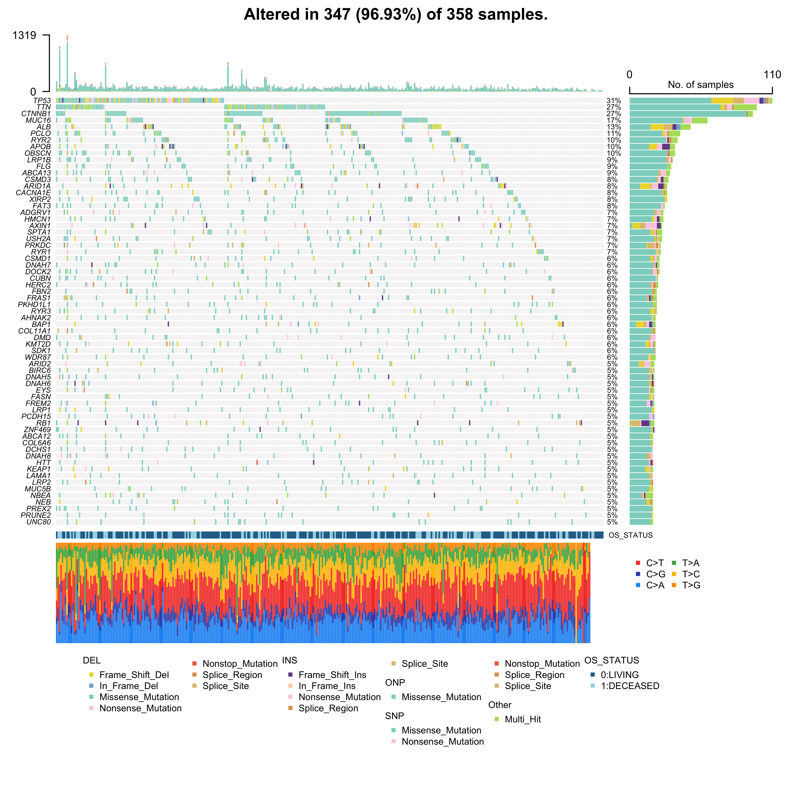

<style>
body {
text-align: justify}
</style>

```{r ifsbm logo, echo = FALSE, out.width = '50%', fig.align="center"}
knitr::include_graphics('../../img/ifsbm_logo.jpeg')
student_mode <- FALSE
complete_mode <- FALSE
```

# 1. Introduction

This is the second day of your training in R for the course "Cancer genomics: big data and predictive models". In this
notebook we will apply two statistical learning procedures that were presented this morning, namely *non-negative matrix
factorisation* (NMF) and *survival analysis*. For these tasks, we will be using mutational data derived from the
bioinformatics analyses of whole-exome sequencing experiments.

In the last part of the notebook you will be provided with the transcriptomic (bulk RNA-seq) and genomic (whole-exome
sequencing) profiles of an unknown patient for which clinicians struggle to make any diagnosis. You task will be
three-fold
  1. to predict the primary site of origin of the tumor
  2. establish the list of mutagenic processes the patient was exposed to
  3. predict the risk of the patient


For the third part you will have to reuse many of the code and techniques we developed over the two days!

# 2. Mutation analysis

In this part, we will load and analyze mutations data from TCGA LIHC (liver hepatocellular carcinoma) study. As for the
first R markdown, we start with loading libraries we will need through this R markdown.

## 2.1 Load libraries

```{r load libraries expression, message=FALSE, warning=FALSE}
suppressPackageStartupMessages(library(RColorBrewer))
suppressPackageStartupMessages(library(dplyr))
suppressPackageStartupMessages(library(tibble))
suppressPackageStartupMessages(library(tidyr))
suppressPackageStartupMessages(library(yarrr))
suppressPackageStartupMessages(library(knitr))
suppressPackageStartupMessages(library(googledrive))
suppressPackageStartupMessages(library(gtools))
suppressPackageStartupMessages(library(patchwork))
suppressPackageStartupMessages(library(ggplot2))


suppressPackageStartupMessages(library(MutationalPatterns))
suppressPackageStartupMessages(library(maftools))
```

Let us load 2 in-house functions for visualizing the extended mutations table and for drawing an overview of the
landscape of the genes most frequently altered.

```{r functions for visualizing data}
source("../../lib/RenderTable.R")
source("../../lib/DrawOncoplot.R")
source("../../lib/MutationsOrder.R")
source("../../lib/DownloadFromGoogleDrive.R")
```

As done yesterday, we shall load some functions that will be useful throughout the notebook.  Execute the chunk in order
to load these functions into your R environment.

```{r useful functions}
getColors <- function(vec, pal="Dark2", alpha=0.7){
  colors <- list()

  palette_predefined <- read.csv("../data/colors_cancer_type.csv")
  palette_predefined <- setNames(palette_predefined$Color, palette_predefined$Name)
  palette_default <- brewer.pal(max(length(unique(vec)),3), pal)
  i <- 1
  for (v in unique(vec)){
    if (toupper(v) %in% names(palette_predefined)){
      colors[[v]] <- adjustcolor(palette_predefined[[toupper(v)]], alpha)
    } else {
      colors[[v]] <- adjustcolor(palette_default[[i]], alpha)
      i <- i+1
    }
  }
  colors
}

getConfusionMatrix <- function(labelsPredicted, labelsCorrect, labels=NULL){
  if (is.null(labels)){
    labels <- unique(union(labelsPredicted, labelsCorrect))
  } else {
    labels <- unique(labels)
  }
  confMat <- data.frame(row.names=labels)

  for (labelPredicted in labels){
    for (labelCorrect in labels){
      confMat[labelPredicted, labelCorrect] <- sum(labelsPredicted==labelPredicted & labelsCorrect==labelCorrect)
    }
  }

  confMat
}


plot_coefs_logistic_regression <- function(nCoeffsPlot=20, CoeffsA, CoeffsB, colorA, colorB){
  ymax <- max(abs(CoeffsA)[1], abs(CoeffsB)[1])
  ymax <- ceiling(ymax/10**(round(log10(ymax))))*10**(round(log10(ymax)))
  xx <- barplot(height=c(CoeffsA[1:nCoeffsPlot], CoeffsB[1:nCoeffsPlot]),
                col=c(rep(colorA, nCoeffsPlot), rep(colorB, nCoeffsPlot)),
                cex.names=0.7, las=2, ylim=c(-ymax, ymax))

  text(xx[1:nCoeffsPlot]+1,
       y=-1,
       label=rownames(CoeffsA)[1:nCoeffsPlot],
       pos=2,
       cex=0.7,
       srt=90)

  text(xx[(nCoeffsPlot+1):(2*nCoeffsPlot)]-0.75,
       y=1,
       label=rownames(CoeffsB)[1:nCoeffsPlot],
       pos=4,
       cex=0.7,
       srt=90)
}

transpose_data_frame <- function(df){
    df_t           <- as.data.frame(t(df))
    rownames(df_t) <- colnames(df)
    colnames(df_t) <- rownames(df)
    df_t
}

plot_oncoprint_signatures <- function(df,
                                      plot_title = "Mutational Signatures",
                                      # Clinical variables to plot: list("Label" = "Column_Name")
                                      clinical_features = list(
                                        "HER2"    = "HER2_Status",
                                        "HR"      = "HR_Status",
                                        "BOR"     = "BOR_Confirmed",
                                        "Benefit" = "Clinical_Benefit"
                                      ),
                                      sig_cols = NULL,
                                      # --- Color & Label Parameters ---
                                      sig_colors_map = sig_colors,      # Default to global sig_colors
                                      sig_labels_map = sig_labels,      # Default to global sig_labels
                                      clinical_colors_map = meta_colors, # Default to global meta_colors

                                      # --- Options ---
                                      custom_groups = NULL,
                                      legend_col_clinical = 2,
                                      legend_col_signature = 2,
                                      pair_by_patient = FALSE,       # Set TRUE for BAS/EOT side-by-side
                                      visit_col = "Biopsy_Visit"     # Column to distinguish visits
) {

  # --- 1. Handle Custom Grouping ---
  local_sig_colors <- sig_colors_map
  local_sig_labels <- sig_labels_map

  if (!is.null(custom_groups)) {
    for (group_name in names(custom_groups)) {
      targets <- custom_groups[[group_name]]
      valid_targets <- intersect(targets, names(df))

      if (length(valid_targets) > 0) {
        df[[group_name]] <- rowSums(df[, valid_targets, drop = FALSE], na.rm = TRUE)
        first_sig <- targets[1]
        if (first_sig %in% names(local_sig_colors)) {
          local_sig_colors[group_name] <- local_sig_colors[first_sig]
        } else {
          local_sig_colors[group_name] <- "grey50"
        }
        local_sig_labels[group_name] <- group_name
        df <- df %>% select(-all_of(valid_targets))
      }
    }
  }

  # --- 2. Data Preparation ---
  group_names <- if(!is.null(custom_groups)) names(custom_groups) else character(0)

  # Normalize
  df_norm <- df %>%
    mutate(total_muts = rowSums(select(., all_of(sig_cols)), na.rm = TRUE)) %>%
    filter(total_muts > 0) %>%
    mutate(across(all_of(sig_cols), ~ . / total_muts))

  # Drop unused signatures
  active_sigs <- df_norm %>% select(all_of(sig_cols)) %>% select(where(~ sum(.) > 0)) %>% names()
  sig_cols <- active_sigs

  # --- 3. Sorting Logic (Updated for Pairs) ---
  sorted_sig_cols <- mixedsort(sig_cols)
  clinical_cols_to_sort <- unlist(clinical_features)
  valid_sort_cols <- intersect(clinical_cols_to_sort, names(df_norm))

  if (pair_by_patient) {
    # STRATEGY: Sort Patients based on their BASELINE sample, then attach EOT next to it

    # 1. Identify "Baseline" rows to establish Patient Order
    # We assume alphabetic sort of visit_col puts "Baseline" or "BAS" before "EOT"
    # Or we prefer rows that have valid clinical data

    # Create a ranking df (One row per patient, prioritizing Baseline data)
    df_ranker <- df_norm %>%
      arrange(Patient_Id, .data[[visit_col]]) %>% # Ensure stable sort within patient
      group_by(Patient_Id) %>%
      slice(1) %>% # Take the first sample (usually Baseline) to represent the Patient
      ungroup() %>%
      arrange(
        across(all_of(valid_sort_cols)),
        desc(pick(all_of(sorted_sig_cols)))
      )

    # Extract the sorted Patient IDs
    sorted_patient_ids <- df_ranker$Patient_Id

    # 2. Apply this order to the full dataframe
    df_sorted <- df_norm %>%
      mutate(Patient_Id = factor(Patient_Id, levels = sorted_patient_ids)) %>%
      arrange(Patient_Id, .data[[visit_col]]) # Sort by Patient (custom order), then Visit

  } else {
    # Standard Sorting (Treat every sample independently)
    df_sorted <- df_norm %>%
      arrange(
        across(all_of(valid_sort_cols)),
        desc(pick(all_of(sorted_sig_cols)))
      )
  }

  # --- 4. Create Unique Plotting ID (Fixes Duplicate Factor Error) ---
  # We must create a unique ID for the x-axis, because Patient_Id appears twice in paired mode

  # Create a unique ID. If Sample_Id exists and is unique, use it. Otherwise construct one.
  df_sorted$Plot_ID <- paste(df_sorted$Patient_Id, df_sorted[[visit_col]], sep="_")

  # Lock in the order based on the sorting done above
  # `unique` is crucial here: if duplicates exist in vector, factor() levels break
  plot_order <- unique(df_sorted$Plot_ID)
  df_sorted$Plot_ID <- factor(df_sorted$Plot_ID, levels = plot_order)


  # --- 5. Prepare Long Format ---
  df_long <- df_sorted %>%
    pivot_longer(cols = all_of(sig_cols), names_to = "Original_Sig", values_to = "Proportion") %>%
    mutate(Signature_Label = ifelse(Original_Sig %in% names(local_sig_labels),
                                    local_sig_labels[Original_Sig], Original_Sig)) %>%
    mutate(Original_Sig = factor(Original_Sig, levels = sorted_sig_cols))


  # --- 6. Plotting Components ---

  strip_theme <- theme_minimal() +
    theme(
      axis.title.x = element_blank(), axis.text.x = element_blank(), axis.ticks.x = element_blank(),
      axis.title.y = element_text(angle = 0, hjust = 1, vjust = 0.5, size = 9),
      axis.text.y = element_blank(), axis.ticks.y = element_blank(),
      panel.grid = element_blank(),
      plot.margin = margin(b = 1, t = 1),
      legend.position = "right", legend.margin = margin(l = 5),
      legend.title = element_text(size=8, face="bold"), legend.text = element_text(size=7),
      legend.key.size = unit(0.3, "cm")
    )

  make_strip <- function(col_name, label, palette) {
    if(is.null(palette)) {
      current_fill <- scale_fill_discrete(name = label)
    } else {
      current_fill <- scale_fill_manual(values = palette, na.value = "grey90", name = label)
    }

    # Use Plot_ID for x-axis
    ggplot(df_sorted, aes(x = Plot_ID, y = 1, fill = !!sym(col_name))) +
      geom_tile() +
      current_fill +
      scale_y_continuous(expand = c(0,0)) +
      labs(y = label) +
      strip_theme +
      guides(fill = guide_legend(ncol = legend_col_clinical))
  }

  # --- 7. Generate Clinical Strips ---

  clinical_plots <- list()
  for (lbl in names(clinical_features)) {
    col_name <- clinical_features[[lbl]]
    if (col_name %in% names(df_sorted)) {
      palette <- clinical_colors_map[[col_name]]
      p <- make_strip(col_name, lbl, palette)
      clinical_plots[[lbl]] <- p
    }
  }

  # --- 8. Main Plot ---
  # Use Plot_ID for x-axis
  p_main <- ggplot(df_long, aes(x = Plot_ID, y = Proportion, fill = Original_Sig)) +
    geom_bar(stat = "identity", width = 1, position = "stack", color = "black", linewidth = 0.05) +
    scale_fill_manual(values = local_sig_colors, labels = local_sig_labels, name = "Signature") +
    scale_y_continuous(expand = c(0,0), labels = scales::percent) +
    labs(y = "Proportion", x = "Patients") +
    theme_classic() +
    theme(
      axis.text.x = element_blank(), axis.ticks.x = element_blank(), axis.line.x = element_blank(),
      plot.margin = margin(t = 5),
      legend.text = element_text(size = 7), legend.key.size = unit(0.4, "cm"),
      legend.title = element_text(size = 8, face = "bold"),
    ) +
    guides(fill = guide_legend(ncol = legend_col_signature, reverse = FALSE))

  # --- 9. Assembly ---

  if (length(clinical_plots) > 0) {
    top_stack <- Reduce(`/`, clinical_plots)
    final_combined <- top_stack / p_main
    h_ratios <- c(rep(0.2, length(clinical_plots)), 5)
  } else {
    final_combined <- p_main
    h_ratios <- 1
  }

  final_plot <- final_combined +
    patchwork::plot_layout(heights = h_ratios, guides = "collect") &
    theme(legend.position = "right", legend.justification = "top", legend.box.margin = margin(l = 10, t = 0, b = 0))

  final_plot <- final_plot + plot_annotation(title = plot_title)
  return(final_plot)
}


visualize_activities_heatmap <- function(H, V, sig_labels_map, title_suffix = "") {

  # 1. Normalize (Relative Contribution)
  # Divide each column of H by the column sums of V (Total Mutations per Patient)
  H_norm <- t(t(H) / colSums(V))

  # 2. Rename rows using the Aetiology Map
  matches_aetiology <- match(rownames(H_norm), names(sig_labels_map))
  new_names <- ifelse(is.na(matches_aetiology),
                      rownames(H_norm),
                      sig_labels_map[rownames(H_norm)])
  rownames(H_norm) <- new_names

  # 3. Sort for display (reverse order for top-down plotting)
  H_norm <- H_norm[rev(rownames(H_norm)), , drop=FALSE]

  # 4. Plot
  heatmap(as.matrix(H_norm),
          Rowv=NA, Colv=NULL,
          keep.dendro=F, cexRow=0.6, cexCol=0.1,
          main = paste("Signature Heatmap:", title_suffix))
}

visualize_activities_oncoprint <- function(H, V, metadata,
                                           sig_labels_map, sig_colors_map, meta_colors_map,
                                           clinical_feature_list,
                                           title_suffix = "") {

  # 1. Normalize
  H_norm <- t(t(H) / colSums(V))

  # 2. Prepare Dataframe (Join with Metadata)
  # Transpose H_norm so rows=samples, cols=signatures
  df_plot <- H_norm %>%
    t() %>%
    as.data.frame() %>%
    rownames_to_column("Subject_Id") %>%
    mutate(Subject_Id=substr(Subject_Id, 1, 12)) %>%
    inner_join(metadata, by = "Subject_Id") %>%
    mutate(Patient_Id = Subject_Id) # Ensure Patient_Id exists

  # 3. Call your custom plotting function
  p <- plot_oncoprint_signatures(
    df = df_plot,
    plot_title = paste("Activities:", title_suffix),
    sig_cols = rownames(H), # The function needs the original signature IDs

    # Maps & Features
    sig_colors_map = sig_colors_map,
    sig_labels_map = sig_labels_map,
    clinical_colors_map = meta_colors_map,
    clinical_features = clinical_feature_list,

    # Layout Options
    legend_col_clinical = 3,
    legend_col_signature = 2
  )

  return(p)
}
```


## 2.2  Load mutation data


We now download the data needed for the notebook

```{r download data}
DownloadFromGoogleDrive(
  data_url="https://drive.google.com/drive/folders/1vfL_a9Bk4rkp0tmnA3aK-ZLsBwqY65W8?usp=drive_link",
  output_dir = "../data",
  files_to_sync = c("CancerGeneCensusCOSMIC_20240117.csv", "lihc_mut_exp.RDS", "X_train_metadata.csv.gz",
                    "summary_activity_cancer_type.tsv", "colors_cancer_type.csv", "colors_oncoplot.csv",
                    "signatures_cosmic_sbs_96_v3.4_grch38.tsv", "aetiologies_and_colors_cosmic_sbs_96_v3.4.tsv")
)
```

**INCLASS WORK** Load the data for `LIHC` TCGA **pancancer atlas 2018 studies** by loading the
`../data/lihc_mut_exp.RDS` object and load the list of CGC cancer genes.

More specifically

1. Use the `read.csv` function (this function is a base R function so you don't need to load any library to use it) to
   load the Cancer Gene Census file `../data/CancerGeneCensusCOSMIC_20240117.csv` and extract the list of gene symbols
   into a variable `CgcGenes`.
2. Use the `readRDS` function to load the file `../data/lihc_mut_exp.RDS` into a `TcgaData` list variable.
3. Explore the contents of the list.


```{r load tcga mutation data, eval=student_mode}
CgcTable <- # YOUR WORK HERE
CgcGenes <- # YOUR WORK HERE
TcgaData <- # YOUR WORK HERE
print(names(TcgaData))
```

The next chunk renders the first lines of the extended mutations table.

<div style = "width:100%; height:auto; margin: auto;">
```{r show design prism, echo=F, eval=student_mode}
RenderTable(TcgaData$MUT, caption="Mutations TCGA LIHC", nrows=10)
```
</div>

Let us now have a look at the landscape of mutations. For that, we will put the table of mutations into a specific
format known as "MAF" format which has standardized column names. Check [this page from the
GDC](https://docs.gdc.cancer.gov/Data/File_Formats/MAF_Format/#protected-maf-file-structure) website to know more about
the standard columns expected in a "MAF" file.

**INCLASS WORK**: Take some time to read through the code of the function `read_df_maf_into_obj_maf` define in the
following function. This function takes a dataframe in a "MAF" format and loads into a "MAF" object from the `maftools`
R package using the `maftools::read_maf` function.

```{r function read into obj maf}

#' Check MAF file by removing and read into a \code{maftools::MAF} object.
#'
#' @param df_maf MAF file loaded in a dataframe
#' @param remove_duplicates Passed to \code{maftools::read.maf}. NB: each variant is uniquely identified by the
#'    combination of Chromosome, Start_Position, Tumor_Sample_Barcode, Reference_Allele, Tumor_Seq_Allele2.
#' @param remove_non_std_chr Remove variants located on non-standard chromosomes (e.g unlocalized segments or
#'    mitochondrial DNA).
#' @param vc_nonSyn Leave to NULL to keep all possible values of Variant_Classification. Otherwise, set to a list of
#'    values of 'Variant_Classification' you want to retain. For example, c("Nonstop_Mutation", "Nonsense_Mutation").
#' @return An object of class \code{maftools::MAF}.
#'
#' @importFrom maftools read.maf
#'
#' @author Yoann Pradat
read_df_maf_into_obj_maf <- function(df_maf, remove_duplicates=T, remove_non_std_chr=T, vc_nonSyn=NULL){
  if (remove_non_std_chr){
    mask_non_std <- grepl("^MT|^(GL[0-9]+).[0-9]|^chrMT|^chr(GL[0-9]+).[0-9]", df_maf[,"Chromosome"], perl=T)
    if (sum(mask_non_std) > 0){
      df_maf <- df_maf[!mask_non_std,]
      cat(paste("--Removed", sum(mask_non_std), "non_std variants out of", length(mask_non_std)), "\n")
    }
  }

  if (is.null(vc_nonSyn)){
    vc_non_syn <- names(table(df_maf$Variant_Classification))
  } else {
    vc_non_syn <- vc_nonSyn
  }

  obj_maf <- maftools::read.maf(maf=df_maf,
                                useAll=T,
                                removeDuplicatedVariants=remove_duplicates,
                                vc_nonSyn=vc_non_syn)


  obj_maf
}
```

We will now build the "MAF" dataframe for the tables of mutations we have loaded into the `TcgaData$MUT` table.

**INCLASS WORK**: Create a `df_maf` dataframe variable with the contents of the `TcgaData$MUT` table and rename the
columns where needed to have the following minimum set of "MAF"-standard (see [this
page](https://docs.gdc.cancer.gov/Data/File_Formats/MAF_Format/#protected-maf-file-structure)) columns:
  - Tumor_Sample_Barcode
  - Hugo_Symbol
  - Chromosome
  - Start_Position
  - End_Position
  - Variant_Classification
  - Reference_Allele
  - Tumor_Seq_Allele2
  - Variant_Type

You should then convert the `df_maf` dataframe into `maftools::MAF` object using the function `read_df_maf_into_obj_maf`.

*Hint*:  You will need to use the `rename` function from `dplyr` package. You may use the function directly on a table
`mytable` via the syntax `mytable %>% dplyr::rename(new_name=old_name)`. You don't need to use double quotes `"`  around
`new_name` and `old_name` in the previous code.

```{r convert MUT table into MAF, eval=student_mode}
df_maf <- # YOUR WORK HERE
obj_maf <- # YOUR WORK HERE
```

The following chunk will draw an oncoplot to help you visualize the distribution of mutations across genes and samples.
To fit the plot into the notebook we will limit ourselves to genes mutated in at least 5\% of patients.

```{r prepare oncoplot, include=F, eval=student_mode}
# show only genes mutated in at least 5% of patients
min_freq <- 0.05
n_tumors <- length(unique(TcgaData$MUT$patientId))
n_tumors_min <- ceiling(min_freq * n_tumors)
genes_list <- df_maf %>%
  dplyr::filter(Hugo_Symbol != "Unknown") %>%
  distinct(Tumor_Sample_Barcode, Hugo_Symbol) %>%
  group_by(Hugo_Symbol) %>%
  summarize(n_tumors=n()) %>%
  dplyr::filter(n_tumors >= n_tumors_min) %>%
  pull(Hugo_Symbol)

# get the table of clinical data
df_cln <- TcgaData$CLINIC %>% rownames_to_column(var="Tumor_Sample_Barcode") %>%
  mutate(Tumor_Sample_Barcode=gsub("\\.", "-", Tumor_Sample_Barcode))

# sort genes
genes_sorted <- df_maf %>% distinct(Tumor_Sample_Barcode, Hugo_Symbol) %>% arrange(Hugo_Symbol) %>%
  group_by(Hugo_Symbol) %>% summarize(n=n()) %>% arrange(desc(n)) %>% pull(var=Hugo_Symbol)
genes_list <- intersect(genes_sorted, genes_list)

vc_list <- setdiff(unique(df_maf$Variant_Classification), NA)
n_genes <- length(genes_list)
n_tumors <- length(unique(df_cln$Tumor_Sample_Barcode))

vc_palette <- read.csv("../data/colors_oncoplot.csv", sep=";")
vc_colors <- setNames(vc_palette$Color, vc_palette$Name)
oncoplot_colors <- list(bg="#f5f3f4",
                        border="white",
                        vc=vc_colors,
                        ann=list(OS_STATUS=setNames(c("#2a6f97", "#a9d6e5"), c("0:LIVING", "1:DECEASED"))))

# read into maftools object
obj_maf_oncoplot <- maftools::read.maf(maf=df_maf,
                                       clinicalData             = df_cln %>% replace(is.na(.), "NA"),
                                       removeDuplicatedVariants = FALSE,
                                       useAll                   = TRUE,
                                       gisticAllLesionsFile     = NULL,
                                       gisticAmpGenesFile       = NULL,
                                       gisticDelGenesFile       = NULL,
                                       gisticScoresFile         = NULL,
                                       cnLevel                  = NULL,
                                       cnTable                  = NULL,
                                       isTCGA                   = FALSE,
                                       vc_nonSyn                = vc_list,
                                       verbose                  = TRUE)

# clinicalFeatures
clinicalFeatures <- intersect(c("OS_STATUS"), colnames(df_cln))
if (identical(clinicalFeatures, character(0))) clinicalFeatures <- NULL

png(filename="oncoplot_tcga_lihc.png", width=8, height=8, units="in", res=600)
DrawOncoplot(obj_maf_oncoplot, genes_list, df_left_bar_data=NULL, df_right_bar_data=NULL,
             oncoplot_colors=oncoplot_colors, n_genes=n_genes, n_tumors=n_tumors,
             draw_titv=T, showTumorSampleBarcodes=FALSE, font_size=0.45,
             df_top_bar_data=NULL, clinicalFeatures=clinicalFeatures)
dev.off()
```

```{r draw oncoplot, echo=F, fig.height=8, fig.width=8, fig.align="center", fig.cap="Oncoplot TCGA LIHC", dpi=300, eval=complete_mode}

```

**QUESTION 1)** Given the distribution of the types of mutations shown on the right plot, can you guess which genes are
generally inactivated by mutations and which genes are generally activated by mutations in this tumor type? Driver genes
that are inactivated through mutations are called "**tumorsuppressor genes**" while drivers genes activated through
mutations are called "**oncogenes**".

&nbsp;

*Hint*: Visit the page <http://www.ensembl.org/info/genome/variation/prediction/predicted_data.html#consequences> to
learn more about the definition of each type of mutation. You may also use the table `TcgaData$MUT` to see how mutations
are distributed for a particular gene. The command `table(TcgaData$MUT[,"CTNNB1"])` for instance will tell you how many
times each specific mutation was seen in the samples from TCGA LIHC study.

&nbsp;

**ANSWER**

## 2.3 Compute 96-class mutational profile

We will now build the 96-class mutational profiles for the TCGA `LIHC` patients for which the data was loaded into the
list `TcgaData`. For that, we will be using the "MAF" table `df_maf` build from the table of mutations `TcgaData$MUT` we
briefly overviewed in the previous chunks.

**INCLASS WORK**: Use the `maftools:trinucleotideMatrix` function to get the matrix of counts of single-base
substitutions per each of the 96 possible mutation types as described this morning during the class. Complete the code
of the function `get_mutation_count_matrix` and test your function on the dataframe `df_maf` built from the
`TcgaData$MUT` table in a previous chunk.

```{r get mutation count matrix}
get_mutation_count_matrix <- function(df_maf, remove_duplicates=T, remove_non_std_chr=T,
                                      vc_non_syn=NULL, genome_build=c("hg19", "hg38", "mm10")){


  # get name of reference genome to be used
  genome_build_to_ref_genome <- list(hg19="BSgenome.Hsapiens.UCSC.hg19",
                                     hg38="BSgenome.HSapiens.UCSC.hg38",
                                     mm10="BSgenome.Mmusculus.UCSC.mm10")

  genome_build <- match.arg(genome_build)
  ref_genome <- genome_build_to_ref_genome[[genome_build]]

  # if chromosome names are not prefixed with "chr", add it
  # you will need to use grepl and "^chr" regex to first identify which rows do not have the prefix
  # then you may apply paste0("chr", myvector) to add "chr" prefix to all elements of myvector

  # YOUR WORK HERE

  # if chromosome X and Y are encoded as  "chr23" and "chr24", rename to "chrX" and "chrY".
  # YOUR WORK HERE

  # read maf file into obj_maf
  # YOUR WORK HERE

  # apply trinucleotideMatrix function
  # set the option useSyn to TRUE
  out_tri <- maftools::trinucleotideMatrix(
  # YOUR WORK HERE
  )
  count_tab <- out_tri$nmf_matrix


  # this part removes the samples having no mutations from the table
  mask_zero_count <- rowSums(count_tab) == 0
  if (sum(mask_zero_count) > 0){
    count_tab <- count_tab[!mask_zero_count,]
    cat(paste("--Removed", sum(mask_zero_count), "samples with zero count out of", length(mask_zero_count)), "\n")
  }

  # order mutation types
  count_tab <- as.data.frame(count_tab)
  count_tab[,names(count_tab)] <- lapply(count_tab[names(count_tab)], as.numeric)
  if (!is.null(mutations_order(mutation_mode="SBS_96"))){
    count_tab <- count_tab[, mutations_order(mutation_mode="SBS_96")]
  }

  # transpose dataframe to have mutation types as rows and samples as columns
  transpose_data_frame(count_tab)
}
```

**QUESTION 2)** What are `hg19`, `hg38`, and `mmc10` reference genomes? How do they differ? What is the effect of
setting the option `remove_non_std_chr=TRUE` in the function `read_df_maf_into_obj_maf`? What is the effect of setting
the option `useSyn=TRUE` in the function `maftools::trinucleotideMatrix`?

&nbsp;

*Hint*: Check the documentation of the function `maftools::trinucleotideMatrix` and read the hand-written documentation
of the function `read_df_maf_into_obj_maf` defined at the beginning of the notebook.

&nbsp;

**ANSWER**


```{r apply get mutation count matrix on MAF, eval=student_mode}
df_count <- get_mutation_count_matrix(df_maf=df_maf, remove_duplicates=T, remove_non_std_chr=T,
                                      vc_non_syn=NULL, genome_build="hg19")
```

**INCLASS WORK**: Select only the columns corresponding to patients having at least 50 point mutations.

```{r select at least 50 mut, eval=student_mode}
df_count_50 <- # YOUR WORK HERE
```


**QUESTION 3)** What is in your opinion the reason why we do not consider mutation profiles of patients where less than
50 point mutations were detected?

&nbsp;

**ANSWER**


## 2.4 Retrieve mutational signatures


### 2.4.1 Prepare functions and data

**INCLASS WORK**: Complete the code of the function `project_onto_reference`. You will neeed to  use the
`MutationalPatterns` R package to project the matrix of mutation counts you just computed, called `V`, on the set of
reference signature `W`. The function should return a list with three elements:

1. `W` the matrix $96 \times K$ of reference signatures
2. `H` the matrix $K \times N$ of signature activities (=loadings) on the samples.
2. `R` the matrix $96 \times N$ of reconstructed mutation profiles ($\tilde{V}$).

*Hint*: Check the [vignette](https://bioconductor.org/packages/release/bioc/vignettes/MutationalPatterns/inst/doc/Introduction_to_MutationalPatterns.html) of the `MutationalPatterns` R package to know more about how to use the functions provided by
this package.


```{r project mutation profiles, eval=student_mode}
project_onto_reference <- function(V, W){
  # matrix of mutation counts
  V <- as.matrix(V)

  # matrix of reference signatures
  W <- as.matrix(W)

  if (nrow(V)!=nrow(W)){
    stop("V (mutation profiles) and W (reference signatures) have a different number of rows")
  }

  if (!isTRUE(all.equal(rownames(V), rownames(W)))){
    if (setequal(rownames(V), rownames(W))){
      message("rows of V (mutation profiles) and W (reference signatures) have the same names but are not aligned.
              Rows of V are reordered")
      V <- V[rownames(W),]
    } else {
    stop("rows of V (mutation profiles) and W (reference signatures) have different names")
    }
  }


  out <- # YOUR WORK HERE
  H <- # YOUR WORK HERE
  R <- # YOUR WORK HERE
  return (list(W=W, H=H, R=R))
}
```

**INCLASS WORK**: Use the `read.delim` function to load the `.tsv` files
`../data/signatures_cosmic_sbs_96_v3.4_grch38.tsv` (signature profiles) and
`../data/aetiologies_and_colors_cosmic_sbs_96_v3.4.tsv` (signature descriptions). Make the "Context" column of the
matrix of profiles the row names.

```{r load signatures, eval=student_mode}
# 1. Load Signatures & Aetiologies
signatures_sbs_96 <- # YOUR WORK HERE

aetiologies <- # YOUR WORK HERE

# Create Maps
sig_labels <- setNames(paste(aetiologies$Signature, aetiologies$Aetiology_Short), aetiologies$Signature)
sig_colors <- setNames(aetiologies$Color, aetiologies$Signature)

# 2. Load and Clean Metadata
# (Done once here, so we don't repeat it in every viz chunk)
tcga_metadata <- read.csv("../data/X_train_metadata.csv.gz") %>%
  mutate(Alcohol_History = na_if(Alcohol_History, "Not Reported")) %>%
  mutate(Pathologic_Stage_Simple = gsub("[A-C]$", "", Pathologic_Stage)) %>%
  mutate(Pathologic_Stage_Simple = replace(Pathologic_Stage_Simple, Pathologic_Stage_Simple == "Stage X", NA))

meta_colors <- list(
  "Pathologic_Stage_Simple" = c("Stage I"="#FAD8D6", "Stage II"="#EDB88B",
                                "Stage III"="#CD5334", "Stage IV"="#2E282A")
)
```


### 2.4.2 Project on all signatures


**INCLASS WORK**: Apply the function `project_onto_reference` to get the activities of the
mutational signatures in TCGA LIHC profiles stored in `df_count_50` table.


```{r perform projection, eval=student_mode}
# get matrix of reference
out_project_all <- # YOUR WORK HERE
```

**INCLASS WORK**: Visualize the activities of the signatures in your set of patients. You will need to divide the each
column of $H$ by the column sum of $V$ to have relative signature activities instead of absolute activities (i.e
mutation counts).


```{r visualize signature activities heatmap all,  fig.cap="Mutational signatures heatmap", fig.height=10, fig.width=6, fig.align="center", dpi=600, eval=complete_mode}
visualize_activities_heatmap(
  H = out_project_all$H,
  V = df_count_50,
  sig_labels_map = sig_labels,
  title_suffix = "TCGA LIHC"
)
```


```{r visualize signature activities barplots,  fig.cap="Mutational signatures barplot", fig.height=10, fig.width=6, fig.align="center", dpi=600, eval=complete_mode}
p_onco <- visualize_activities_oncoprint(
  H = out_project$H,
  V = df_count_50,
  metadata = tcga_metadata,
  sig_labels_map = sig_labels,
  sig_colors_map = sig_colors,
  meta_colors_map = meta_colors,
  clinical_feature_list = list("Stage" = "Pathologic_Stage_Simple"),
  title_suffix = "TCGA LIHC"
)

# Print and Save
ggsave("tcga_lihc_oncoprint_all.pdf", p_onco, width=10, height=8)
p_onco
```

### 2.4.3 Project on selected signatures

**INCLASS WORK**: Repeat the projection and visualization using a restricted sets of signatures. You will need to load the file `summary_activity_cancer_type.tsv` and select only signatures labelleed Use=TRUE.


```{r perform projection and visualize, eval=student_mode}
# YOUR WORK HERE
```


# 3. Survival analysis

Let us now consider the survival data from patients included in the TCGA LIHC study. The next chunk loads libraries that
will be useful for this analysis.

```{r load library survival analysis}
library(survival)
library(glmnet)
```

## 3.1 Data processing

The next chunk processes the `OS_STATUS` variable of the `TcgaData$CLINIC` table to make it usable in survival models.

```{r load data survival}
CgcTable <- read.csv("../data/CancerGeneCensusCOSMIC_20240117.csv")
CgcGenes <- CgcTable$Gene.Symbol

TcgaData <- readRDS("../data/lihc_mut_exp.RDS")

TcgaData$CLINIC[TcgaData$CLINIC$OS_STATUS=="0:LIVING", "Vital_Status"] <- "Alive"
TcgaData$CLINIC[TcgaData$CLINIC$OS_STATUS=="1:DECEASED", "Vital_Status"] <- "Deceased"
TcgaData$CLINIC[TcgaData$CLINIC$OS_STATUS=="0:LIVING", "OS_STATUS"] <- 0
TcgaData$CLINIC[TcgaData$CLINIC$OS_STATUS=="1:DECEASED", "OS_STATUS"] <- 1
TcgaData$CLINIC["OS_STATUS"] <- as.numeric(TcgaData$CLINIC$OS_STATUS)
TcgaData$CLINIC["OS_MONTHS"] <- as.numeric(TcgaData$CLINIC$OS_MONTHS)

# select only patients with expression and survival data
patients_by_modality <- list(row.names(TcgaData$CLINIC), row.names(TcgaData$EXP), unique(TcgaData$MUT$patientId))
patients_common <- Reduce(intersect, patients_by_modality)
TcgaData$CLINIC <- TcgaData$CLINIC[patients_common,]
TcgaData$EXP <- TcgaData$EXP[patients_common,]
TcgaData$MUT <- TcgaData$MUT %>% filter(patientId %in% patients_common)

```

Unfortunately, there are some NAs in the data, in particular survival data. In this work, we will handle NAs by just
discarding them. This is acceptable because there is a low number of such cases. It would not be suitable otherwise. We
will also discard patients with survival time of 0.

```{r remove bad survival data}
patientsWithNAs <- rowSums(is.na(TcgaData$CLINIC[,c("OS_MONTHS", "OS_STATUS")])) > 0
patientsWithNAsNames <- rownames(TcgaData$CLINIC[patientsWithNAs,])
TcgaData$CLINIC <- TcgaData$CLINIC[!patientsWithNAs,]
TcgaData$EXP <- TcgaData$EXP[!patientsWithNAs,]
TcgaData$MUT <- TcgaData$MUT %>% filter(!patientId %in% patientsWithNAsNames)

patientsWithZeroOS <- TcgaData$CLINIC$OS_MONTHS == 0
patientsWithZeroOSNames <- rownames(TcgaData$CLINIC[patientsWithZeroOS,])
TcgaData$CLINIC <- TcgaData$CLINIC[!patientsWithZeroOS,]
TcgaData$EXP <- TcgaData$EXP[!patientsWithZeroOS,]
TcgaData$MUT <- TcgaData$MUT %>% filter(!patientId %in% patientsWithZeroOSNames)
```

## 3.2 Survival

The `survfit` function of the survival package computse the cumulative probability of survival taking into account
censored data in the calculation. At each time step $l$, the cumulative probability $P_{l}$ is calculated by:

$P_{l} = P_{l-1} \cdot \left( \frac{ NatRisk_{l}- Ndeath_{l} }{ NatRisk_{l}} \right)$

The cumulative probability of survival allow you to plot the Kaplan-Meier curve, which is a standard way to visualize
the distribution of the survival data accross the cohort.

```{r plot survival data, fig.height=6, fig.width=6, fig.align="center"}
plot(survfit(Surv(time = TcgaData$CLINIC$OS_MONTHS, event=TcgaData$CLINIC$OS_STATUS) ~ NULL),
     mark.time = T,
     main="Kaplan Meier curve",
     ylab="Probability of survival", xlab="Time in months")
```

**QUESTION 4)** Provide an estimate of the median survival time of the patients from the TCGA LIHC study.

&nbsp;

**ANSWER**

&nbsp;

Tumors may be graded or classified according to many classification systems. The AJCC classification system, also
called, TNM system, provides a risk classification of the tumor according to the tumor size, spread to nearby lymph
nodes, and spread to other body parts (metastases).

**INCLASS WORK**: Draw the Kaplan-Meier curves of the LIHC patients stratified by the AJCC classification system. The
classification is available in the variable `AJCC_PATHOLOGIC_TUMOR_STAGE`. For the purpose of the graph, you should first
simplify the classification to have only 4 classes, namely `STAGE I/II/III/IV`.

```{r plot survival data ajcc, eval=student_mode}
TcgaData$CLINIC$AJCC_SIMPLE <- # YOUR WORK HERE

stage_unique <- setdiff(sort(unique(TcgaData$CLINIC$AJCC_SIMPLE)), NA)
stage_colors <- getColors(stage_unique)
patientsWithNAsStage <- is.na(TcgaData$CLINIC$AJCC_SIMPLE)

plot(survfit(Surv(time=# YOUR WORK HERE,
                  event=# YOUR WORK HERE
                  ) ~ # YOUR WORK HERE
             ),
     mark.time = T,
     col=unlist(stage_colors),
     main="Kaplan Meier curve",
     ylab="Probability of survival", xlab="Time in months")

legend("topright",legend=stage_unique, pch=16, cex=0.8,
       col=sapply(stage_unique, function(x) stage_colors[[x]]))
```


## 4.3 A semi-parametric model survival: the Cox model

In the previous part we trained a binary classification model to learn how to classify between 2 tumor types using
expression data. Your task now is to predict the survival time of patients using mutations data.

Modeling survival data for various parameters is a historical discipline (Cox introduced his model in his 1972 paper
[@cox_regression_1972]). In the last two decades, the emergence of inceasingly high-throughput sequencing techniques has
made the analysis of associations between the molecular profiles and phenotypes of cancers a much more challenging task.
Predicting the survival time is particularly difficult as you will see in this example.

Modeling survival looks like a regression task because you have numeric data to predict. However, survival analysis is a
distinct discipline due to the fact that the observation of the outcome is not always complete. The observed time may be
left-censored (the patient was alive on the last date he visited the hospital), right-censored (the patient entered the
trial some time after the start of their disease), or both. Analysis and modeling of censored data calls for specific
techniques and the Cox model is the most famous example.

**INCLASS WORK**: Build a matrix with the survival data (`OS_MONTHS`, `OS_STATUS`) and the mutation status (1/0) of all
genes mutated in at least 3% of the cohort. You should then define train and test indices and fit a Cox model on the
train data and assess the model performance on the test data. The performance of the model may be assessed via the
C-index. Eventually, visualize the model top negative and positive coefficients to get insight into the genes that are
predicive of good and poor prognosis.

&nbsp;

*Hint*: You may mirror the code we have used for training logistic regression models. Use once again the
`glmnet` function changing `family = "binomial"` to `family = "cox"` in order to train a Cox model. The `y` argument of
the glmnet function should be a `Surv` object as in the chunk of the first Kaplan-Meier curve above. Mutations statuses
may be obtained directly from `TcgaData$MUT` after conversion of the aminoacid changes to 1/0 status or may be obtained
by processing `TcgaData$MUTEXT`.

```{r cox model, eval=student_mode}
# select survival variables
SurvivalData <- TcgaData$CLINIC  %>% select(OS_STATUS, OS_MONTHS)

# prepare mutations variables
MutationsData <- data.frame(row.names=rownames(TcgaData$CLINIC))
for (CgcGene in CgcGenes){
  patientsMutated <- TcgaData$MUT %>% filter(hugoGeneSymbol==CgcGene) %>% distinct(patientId) %>% pull(var=patientId)
  MutationsData[CgcGene] <- 0
  MutationsData[patientsMutated, CgcGene] <- 1
}

# select among CgcGenes only the genes mutated in at least 5% of the cohort
genes_use <- # YOUR WORK HERE
MutationsData <- MutationsData[,genes_use]

# assemble
CoxData <- cbind(SurvivalData, MutationsData)
predictors <- colnames(MutationsData)

# select train and test indices
studySize <- # YOUR WORK HERE
trainProp <- # YOUR WORK HERE
trainIndex <- # YOUR WORK HERE
testIndex <- seq(studySize)[!seq(studySize) %in% trainIndex]

print(paste("Training size:", length(trainIndex)))
print(paste("Test size:", length(testIndex)))
```

```{r coef glmnet cox best, fig.cap="Top Cox model coefficients", fig.height=6, fig.width=6, fig.align="center", eval=student_mode}
fitCoxCoefs <- as.matrix(coefficients(fitCoxCv))
fitCoxCoefs <- fitCoxCoefs[!grepl("(Intercept)", rownames(fitCoxCoefs)),,drop=F]

GoodGenes <- fitCoxCoefs[fitCoxCoefs < 0,,drop=F]
GoodGenes <- GoodGenes[order(GoodGenes, decreasing=F),,drop=F]

BadGenes <- fitCoxCoefs[fitCoxCoefs > 0,,drop=F]
BadGenes <- BadGenes[order(BadGenes, decreasing=T),,drop=F]

nGenesPlot <- 10
ymax <- max(BadGenes[1], -GoodGenes[1])
ymax <- ceiling(ymax/10**(round(log10(ymax))))*10**(round(log10(ymax)))
xx <- barplot(height=c(BadGenes[1:nGenesPlot], GoodGenes[1:nGenesPlot]),
              col=c(rep("#ff758f", nGenesPlot), rep("#aacc00", nGenesPlot)),
              cex.names=0.7, las=2, ylim=c(-ymax, ymax))

text(xx[1:nGenesPlot]+0.5,
     y=-0.05,
     label=rownames(BadGenes)[1:nGenesPlot],
     pos=2,
     cex=0.7,
     srt=90)

text(xx[(nGenesPlot+1):(2*nGenesPlot)]-0.5,
     y=0.05,
     label=rownames(GoodGenes)[1:nGenesPlot],
     pos=4,
     cex=0.7,
     srt=90)
```

**QUESTION 5)** How would you explain to a clinician (mathematical words not allowed) what a C-index is? Comment on the
C-index of your model (good enough to use in clinic?).

&nbsp;

**ANSWER**
